# Comply to Connect Reporting with the Cisco Enterprise Networking for Splunk Platform App - Version 3.2
### Executive Summary

**Comply to Connect (C2C)** is a critical program, especially for the Department of Defense (DoD), serving as a bridge to Zero Trust access. It automates the process of controlling which devices are allowed to authenticate and connect to the DoD Information Network (DoDIN). C2C ensures that devices are automatically remediated if found non-compliant and provides comprehensive reporting and visibility throughout the process. This program lays the groundwork for Zero Trust by establishing inventory and endpoint health as foundational elements, enabling consistent policy enforcement and behavior attribution to users and devices.

Cisco’s Identity Services Engine (ISE) plays a central role in C2C by providing:

- **Discovery and Identification:** Automated detection, identification, and categorization of all endpoints connecting to the network.
- **Interrogation:** Compliance posture verification through device scanning and posture assessment.
- **Auto-Remediation:** Automated remediation actions to bring devices into compliance with minimal user impact.
- **Authorization:** Granular access control based on device/user profiles, enforcing least privilege and network segmentation.
- **Situational Awareness and Enforcement:** Continuous monitoring and re-authentication to maintain compliance throughout the session.

This structured approach not only meets C2C requirements but also forms the foundation for a Zero Trust architecture by enabling continuous trust verification and dynamic policy enforcement.

### Importance of Monitoring and Reporting 

Monitoring and reporting are essential components of both Comply to Connect and Zero Trust frameworks. Continuous visibility into all devices and their compliance status allows organizations to:

- Detect and respond to changes in device posture or behavior in real time.
- Maintain situational awareness to enforce policies dynamically.
- Provide detailed, customizable reporting and dashboards that offer clear insights into compliance progress and security posture.
- Facilitate rapid remediation and minimize operational impact through automated workflows and open APIs for integration with other security tools.

By integrating monitoring and reporting, organizations can ensure that trust is continuously verified, risks are minimized, and security policies are enforced consistently across all network access points, which is fundamental to the effectiveness of Zero Trust security. Splunk is a critical component in supporting Comply to Connect (C2C) and Zero Trust frameworks by delivering comprehensive monitoring and reporting capabilities. It provides continuous visibility across users, devices, and infrastructure, enabling real-time verification of security posture and compliance. By integrating data from diverse sources, Splunk offers advanced analytics and machine learning to detect anomalies and prioritize responses effectively. Its automation and orchestration features reduce manual effort and accelerate incident handling, ensuring enforcement of zero trust policies. Additionally, Splunk’s customizable reporting supports regulatory compliance requirements such as FedRAMP and DoD mandates. With scalable deployment options across on-premises and cloud environments, Splunk enhances security operations by empowering teams to maintain continuous trust and resilience within Zero Trust architectures. Together, Cisco and Splunk deliver the visibility, analytics, and automation essential for effective monitoring and reporting in C2C and Zero Trust implementations.  

---
- [Comply to Connect Reporting with the Cisco Enterprise Networking for Splunk Platform App - Version 3.2](#comply-to-connect-reporting-with-the-cisco-enterprise-networking-for-splunk-platform-app---version-32)
    - [Executive Summary](#executive-summary)
    - [Importance of Monitoring and Reporting](#importance-of-monitoring-and-reporting)
- [Prerequisites](#prerequisites)
- [Communications](#communications)
- [Splunk Cisco Enterprise Networking Application and Technical Add-Ons Installation](#splunk-cisco-enterprise-networking-application-and-technical-add-ons-installation)
    - [Download App and TAs](#download-app-and-tas)
    - [Install Reporting App and TAs on Splunk Server](#install-reporting-app-and-tas-on-splunk-server)
- [Cisco Identity Services Engine Configuration](#cisco-identity-services-engine-configuration)
    - [Configure ISE Syslog](#configure-ise-syslog)
    - [Configure ISE Repositories](#configure-ise-repositories)
    - [ISE Analytics CLI Account and Host Key Configuration](#ise-analytics-cli-account-and-host-key-configuration)
- [Cisco Catalyst Center Configuration - Optional](#cisco-catalyst-center-configuration---optional)
    - [Create Catalyst Center Reports](#create-catalyst-center-reports)
    - [Create API User](#create-api-user)
    - [Create Scheduled Reports](#create-scheduled-reports)
      - [Compliance Report](#compliance-report)
      - [Inventory Report](#inventory-report)
- [Splunk Reporting Application Configuration](#splunk-reporting-application-configuration)
    - [Create Indexes on Splunk](#create-indexes-on-splunk)
  - [Create Inputs in the Cisco Catalyst Add-on for Splunk](#create-inputs-in-the-cisco-catalyst-add-on-for-splunk)
    - [Cisco Identity Services Engine](#cisco-identity-services-engine)
      - [Analytics Account Configuration](#analytics-account-configuration)
      - [Analytics Input Configuration](#analytics-input-configuration)
      - [Syslog Configuration](#syslog-configuration)
    - [Cisco Catalyst Center](#cisco-catalyst-center)
    - [Tenable Add-On](#tenable-add-on)
- [Search Macros](#search-macros)
    - [Understanding Splunk Search Macros](#understanding-splunk-search-macros)
      - [What is a Search Macro?](#what-is-a-search-macro)
      - [How Macros are Used in Splunk](#how-macros-are-used-in-splunk)
      - [Macro Anatomy in the Cisco Catalyst App](#macro-anatomy-in-the-cisco-catalyst-app)
    - [Data Scoping Macros](#data-scoping-macros)
    - [Posture \& Compliance Regex Macros](#posture--compliance-regex-macros)
    - [Categorization Macros](#categorization-macros)
      - [cisco\_catalyst\_CYBERCOM\_Macro](#cisco_catalyst_cybercom_macro)
      - [cisco\_catalyst\_CYBERCOM\_Unknown](#cisco_catalyst_cybercom_unknown)
    - [Reporting \& Metadata Macros](#reporting--metadata-macros)
    - [Access Level Mapping Macros](#access-level-mapping-macros)
      - [cisco\_catalyst\_access\_level\_full](#cisco_catalyst_access_level_full)
      - [cisco\_catalyst\_access\_level\_limited](#cisco_catalyst_access_level_limited)
      - [cisco\_catalyst\_access\_level\_deny](#cisco_catalyst_access_level_deny)
    - [Tenable Plugin Macros](#tenable-plugin-macros)
- [Cisco ISE Network Device Groups Lattitude and Longitude Mapping](#cisco-ise-network-device-groups-lattitude-and-longitude-mapping)
- [Cisco Enterprise Networking for Splunk Platform App](#cisco-enterprise-networking-for-splunk-platform-app)
  - [Analytics Reports Menu](#analytics-reports-menu)
    - [Overview Reports](#overview-reports)
    - [Endpoint Compliance](#endpoint-compliance)
    - [Network Compliance](#network-compliance)
    - [Master Endpoint Record](#master-endpoint-record)
  - [Detailed Reports Menu](#detailed-reports-menu)
    - [Step 1 - Device Classification](#step-1---device-classification)
    - [Step 2 - Manageability and Compliance](#step-2---manageability-and-compliance)
    - [Step 3 - Compliance Remediation](#step-3---compliance-remediation)
    - [Step 4 - ICAM Summary](#step-4---icam-summary)
    - [Implementation Metrics](#implementation-metrics)
- [Required for endpoints over 10,000 Endpoints](#required-for-endpoints-over-10000-endpoints)
    - [Modify cisco\_catalyst\_kv\_view Using "sort 0"](#modify-cisco_catalyst_kv_view-using-sort-0)
- [Change Navigation to only show Comply to Connect (C2C) Views - Optional](#change-navigation-to-only-show-comply-to-connect-c2c-views---optional)
    - [Create the local UI Navigation folder structure.](#create-the-local-ui-navigation-folder-structure)
    - [Copy the current default.xml from default to local](#copy-the-current-defaultxml-from-default-to-local)
    - [Edit the local copy of the default.xml](#edit-the-local-copy-of-the-defaultxml)
    - [Reload the Splunk Web UI](#reload-the-splunk-web-ui)
- [APPENDIX](#appendix)
  - [Reports / Saved Searches](#reports--saved-searches)
    - [Lookup Builders \& Discovery](#lookup-builders--discovery)
    - [ISE Analytics and Syslog Reports](#ise-analytics-and-syslog-reports)
    - [Tenable Asset Intelligence (Windows \& Other)](#tenable-asset-intelligence-windows--other)
    - [Step Reporting](#step-reporting)
      - [Step 1: Visibility](#step-1-visibility)
      - [Step 2: Management](#step-2-management)
      - [Step 3: Remediation](#step-3-remediation)
      - [Step 4: Access Control](#step-4-access-control)
    - [Master Endpoint Record Aggregator \& Implementation Scoring](#master-endpoint-record-aggregator--implementation-scoring)
      - [Master Aggregator Report](#master-aggregator-report)
      - [Master Endpoint Record Report and Output for CMRS reporting add-on](#master-endpoint-record-report-and-output-for-cmrs-reporting-add-on)
  - [SyslogNG Configuration for ISE Syslog over 8192 bytes](#syslogng-configuration-for-ise-syslog-over-8192-bytes)
    - [Check \& Set SELINUX Permissions. Use TCP or UDP example based on desired output from ISE.](#check--set-selinux-permissions-use-tcp-or-udp-example-based-on-desired-output-from-ise)
    - [Create Directory for ISE Logs in /var/log](#create-directory-for-ise-logs-in-varlog)
    - [Restart SyslogNG for configuration to be loaded](#restart-syslogng-for-configuration-to-be-loaded)

---

# Prerequisites
This document assumes that following is already scoped/sized and installed in the environment.  
* Required
  * Cisco Identity Services Engine (ISE)
    * w/ Analytics Token Applied/Enabled
  * Splunk Enterprise
  * Remote SFTP Repository reachable by ISE and Splunk
* Optional 
  * Cisco Catalyst Center
  * Tenable Security Center

---

# Communications
The following communications are required for the Application and TA to generate and gather the data required.  
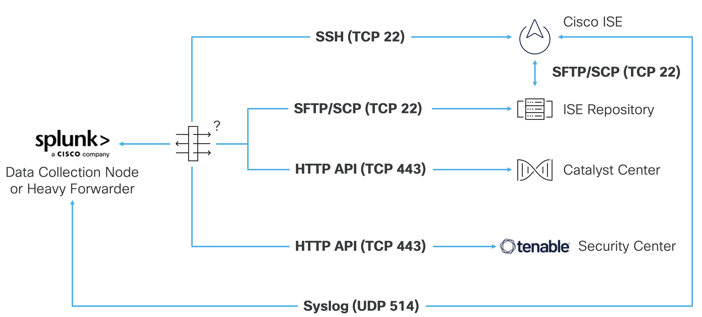

---

# Splunk Cisco Enterprise Networking Application and Technical Add-Ons Installation
### Download App and TAs
Cisco Enterprise Networking for Splunk Platform Application  
[https://splunkbase.splunk.com/app/7539](https://splunkbase.splunk.com/app/7539)  
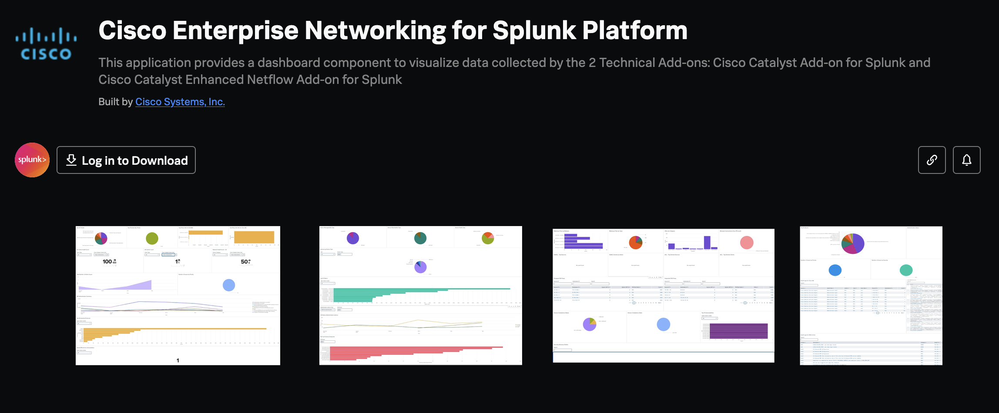

Cisco Catalyst Add-on for Splunk  
[https://splunkbase.splunk.com/app/7538](https://splunkbase.splunk.com/app/7538)  


> **Implementation Note:** The Cisco Catalyst Enhanced Netflow Add-on for Splunk prerequisite is NOT required for Comply to Connect (C2C) Reporting

Tenable Add-On for Splunk - Optional  
[https://splunkbase.splunk.com/app/4060](https://splunkbase.splunk.com/app/4060)  
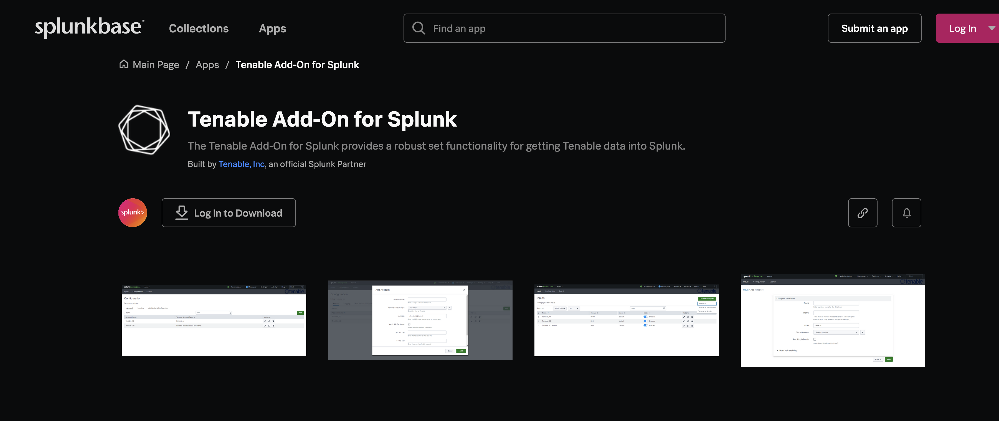

### Install Reporting App and TAs on Splunk Server
Open a web browser and go to http://<IP|Hostname>:8000  
Navigate to Apps > Manage Apps  
Click **"Install App From File"** on the top right, select the downloaded app bundle and click **Upload**  

---

# Cisco Identity Services Engine Configuration
### Configure ISE Syslog
On the ISE Admin UI navigate to **Administration > System > Logging > Remote Logging Targets**  
Click **"Add**"  
Configure the Splunk Reporting Destination  
* **Name:** Simple Name in the ISE UI  
* **Target Type:** UDP SysLog / TCP SysLog  
* **Host / IP Address:** \<SplunkReportingToolIP\>  
* **Port:** UDP/TCP Syslog (Ensure that the firewall of the server is open to receive on this port)  
* **Maximum Length:** 8192 (Must be set to this maximum length)  
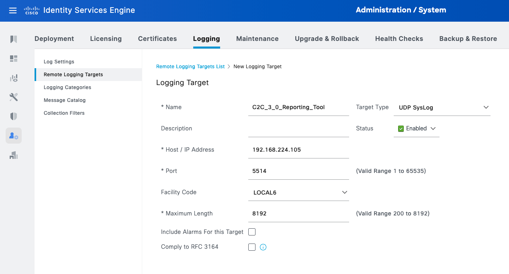  
Click **Submit**  

Navigate to **Logging Categories**  
- The Reporting Tool requires 8 logging categories to gather the data for C2C reporting. The sizing of the environment is based on these categories only. Any additional categories that are sent may increase the ingest sizing and could lead to license violations.

The required logging categories are:
* **AAA Audit**
    * AAA Audit
    * Failed Attempts
    * Passed Authentications
* **Accounting**
    * Accounting
    * RADIUS Accounting
* **Administrative and Operational Audit**
    * Administrative and Operational Audit
* **Posture and Client Provisioning Audit**
    * Posture and Client Provisioning Audit
* **Profiler**
    * Profiler

To add the Logging Target to the Category, click the Category Name, Select the Target from the **"Available"** column and click the **">"** icon to move it to the **"Selected"** column.

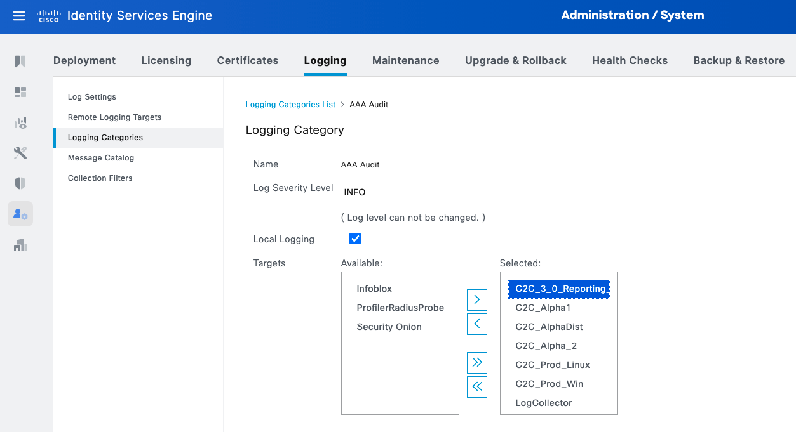

Repeat the above for all of the logging categories. After complete you can filter based on your Target name to confirm.

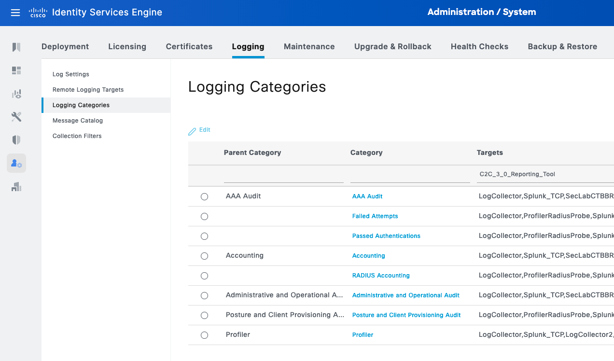

---


### Configure ISE Repositories
For Analytics reports to be successfully gathered from ISE into the reporting tool it will require the names and access to a local disk and remote SFTP repository. To configure these in ISE, navigate to **Administration > System > Maintenance** and select **Repository** in the menu.  

Click **"Add"** to configure the local disk repository if one is not already defined
* **Repository Name:** \<disk-example\>
* **Protocol:** DISK
* **Path:** /

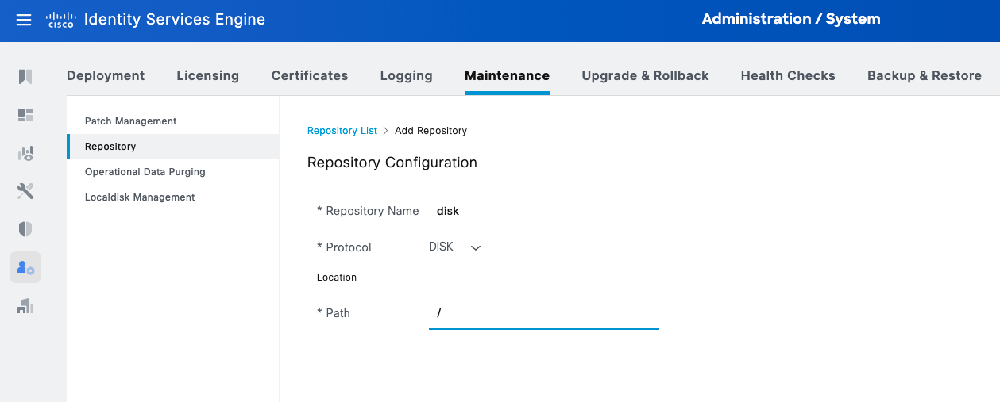

Click **"Add"** to configure an SFTP repository if one is not already defined. An SFTP remote repository reachable by ISE and Splunk is a requirement if you do not have one already deployed.
* **Repository Name:** \<SFTP-Example\>
* **Protocol:** SFTP
* **Server Name:** \<IP\Hostname\>
* **Path:** \</ReportingApp30\>
* **User Name:** \<username\>
* **Password:** \<password\>

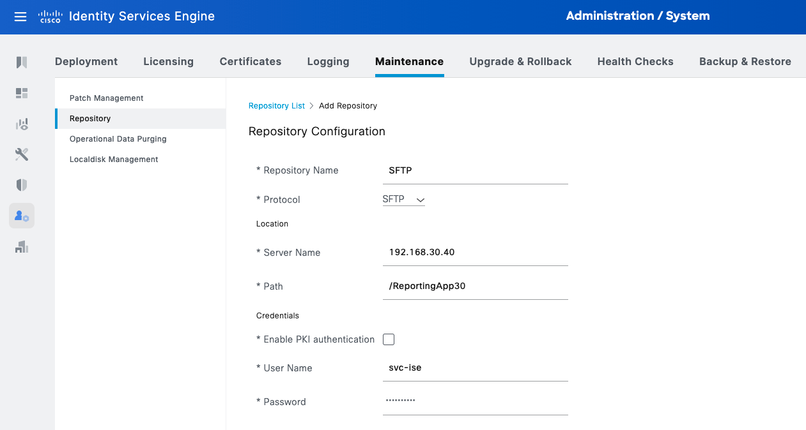

When you click **"Submit"** for the SFTP repo you will be prompted to ensure that the Crypto Host Key must be added using the CLI. This will be covered in the CLI account creation steps below.

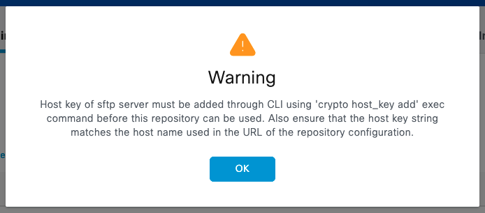

---

### ISE Analytics CLI Account and Host Key Configuration
You will need to create a dedicated CLI account on the ISE PAN node to use with the reporting app for running and moving the reports to the repository for processing.  
Log in to your ISE primary Admin node with your existing credentials  
Execute the following to create the account with your desired username and password.  
```username reporting password plain ************* role admin```  
(Special characters may require double quotes \"). 
Note: The password will be required to be changed on the first login so don't use your final desired password until the change password prompt is presented.

After the user account is created we will need to log in using SSH with that user account to complete the SFTP Host Key configuration.  
As the new admin user execute the following to save and validate the host key addition:  

```crypto host_key add host <IP\Hostname>```  

You should see "host key fingerprint added" or run:

```show crypto host_keys```
OR
```show repository <SFTPrepoName>``` to validate that you can successfully connect to the repository.

---

# Cisco Catalyst Center Configuration - Optional
### Create Catalyst Center Reports
The C2C Reporting App pulls the result of native Catalyst Center reports to present dashboards for network device compliance. The following screenshots show the required reports. The TA will require an API account with permissions to pull the reports and the report names will also be required.  

### Create API User
Navigate to **System > Users & Roles > User Management** and click **"Add"**  
Create the User Account with minimum of OBSERVER-ROLE for API collection of the reports.  
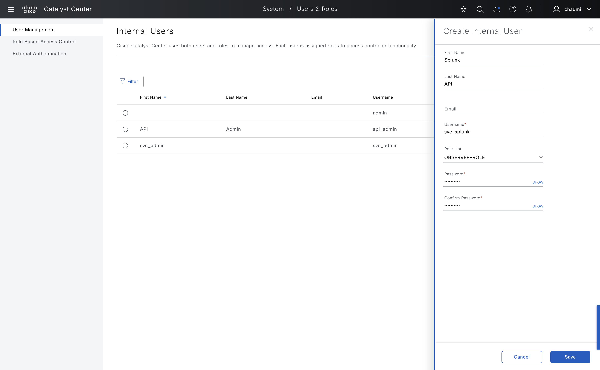
Note: External Authentication is also usable with role assignment.

### Create Scheduled Reports
#### Compliance Report
Navigate to **Reports > Report Templates > Compliance** and click **"Generate"**  
Finish the Report wizard with the following inputs:
* **Report Name:** Simple Name (This will be input into the Add-on)
* **Scope:** (Default is all devices, ingest size can be reduced with optional filter of Compliance Status = Non Compliant)
* **Report Type:** CSV
* **Fields:** (Default is all fields below, \* denotes minimum required fields)
    * Sl.No \*
    * Device Name \*
    * Device Family
    * Device Type
    * IP Address \*
    * Compliance Status \*
    * Software Image \*
    * Startup Vs Running Configuration \*
    * Critical Security Advisories \*
    * Network Profile \*
    * Network Settings \*
    * EoX \*
* **Schedule:** At least once a week  
All other configuration should be left at the default.

#### Inventory Report
Navigate to **Reports > Report Templates > Inventory** and click **"Generate"** for the **"All Data"** report  
Finish the Report wizard with the following inputs:
* **Report Name:** Simple Name (This will be input into the Add-on)
* **Scope:** Global (ingest size can be reduced with optional filter of Location if reporting scope is smaller than Global)
* **Report Type:** CSV
* **Fields:** (Default is all fields below, \* denotes minimum required fields)
    * Device Family
    * Device Type
    * Device Name \*
    * Serial No. \*
    * IP Address \*
    * Status
    * Software Version \*
    * Up Time \*
    * Part No. \*
    * Location \*
    * No. of Users \*
    * No. of ethernet ports
    * Time Since Code Upgrade via Cisco DNA Center SWIM
    * DNA License
    * Network License \*
    * Fabric Role
* **Schedule:** At least once a week  
All other configuration should be left at the default.

Take note of the Report Names as they will be entered into the Add-on later in this guide

---

# Splunk Reporting Application Configuration 
### Create Indexes on Splunk
In Splunk configure indexes for the data collection. Avoid using the **"Main**" index. Individual indexes provide separate retention, access, and meaningful naming in the case that data needs to be purged from the system.  
For the reporting app there will be:
* Syslog data from ISE
* Analytics Report data from ISE
* Network Compliance data from Catalyst Center - Optional
* Hardware and Vulnerability data from Tenable - Optional

In this example separate indexes will be used for each source.  
* ise_syslog
* ise_analytics
* catalyst_center (optional)
* tenable (optional)

To configure the indexes, go to the Splunk Indexer instance and select **Settings > Indexes**  
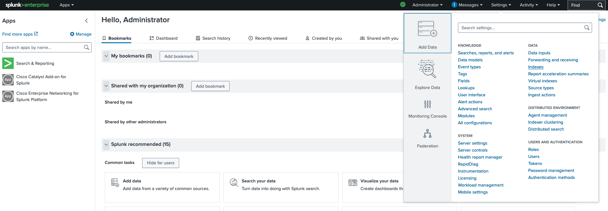  

Click **"New Index**" and give it a name and **"Max size**" values (Size is dependent the environment)  
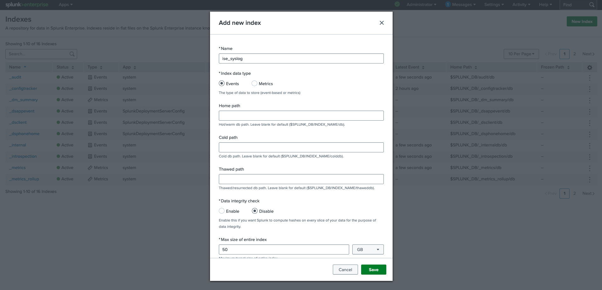  

---

## Create Inputs in the Cisco Catalyst Add-on for Splunk

### Cisco Identity Services Engine 
On the Splunk UI navigate to the **Cisco Catalyst Add-on for Splunk** and click on **"Configure Application"** on the Identity Services Engine (ISE) tile.  
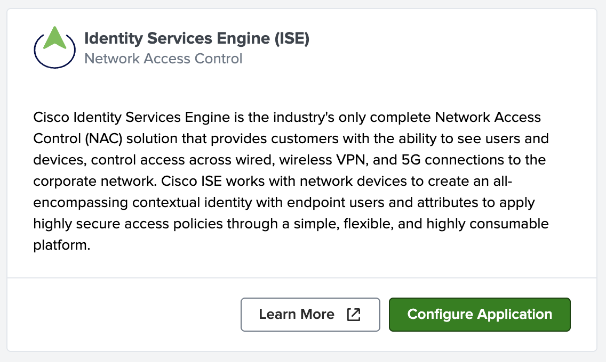

#### Analytics Account Configuration
Once in the ISE Application click on the **"Configuration**" tab and click **"Add"**  
In the pop up, change the **"Account Type"** to Analytics Reports and input the requested parameters.
* **Account Type:** Analytics Reports
* **Account Name:** Simple Name for Account Settings
* **IP Address / Hostname:** \<IPAddress/Hostname\>
* **Username:** \<CLI User Account\> 
* **Password:** \<CLI User Password\>
* **ISE SSH Port:** 22 (default)
* **Repository Address:** \<SFTP Repository Address/Hostname\>
* **Repository User:** \<Repo User Account\>   
* **Repository Password:** \<Repo User Password\> 
* **Repository SCP/SFTP Port:** 22 (default)

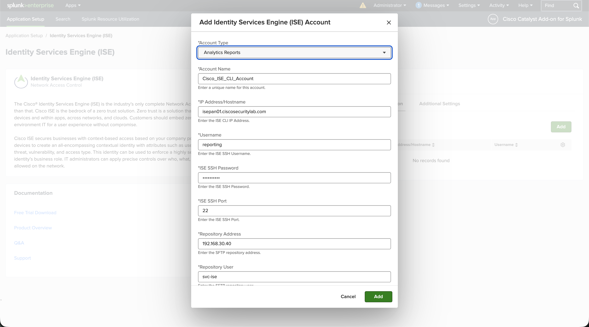

#### Analytics Input Configuration
Navigate to the **"Inputs"** tab and select the **"ISE Analytics Reports"** input from the dropdown and input the requested parameters.  
* **Input Type:** ISE Analytics Reports
* **Name:** Simple Name for Input
* **Interval:** \<Interval in Seconds\> (3600 default, 86400 recommended)
* **Index:** \<Index previously configured\>
* **Cisco ISE Account:** Select the Account Name from the previous step
* **Cisco ISE Disk Repository Name:** \<Local Disk Repo Name\>
* **Cisco ISE SFTP Repository Name:** \<SFTP Repo Name\>
* **Repository Path:** \<Path with trailing slash\>
Note: In most cases the Repository Path will match the path configured in ISE.  Ensure that a trailing "/" is on the repository path.

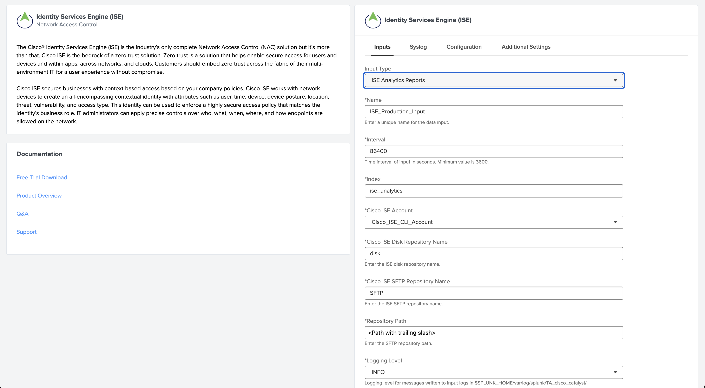

#### Syslog Configuration
Navigate to the **"Syslog"** tab and input the Syslog protocol and port configured on the ISE Syslog Target step and select the Index created for Syslog input.  

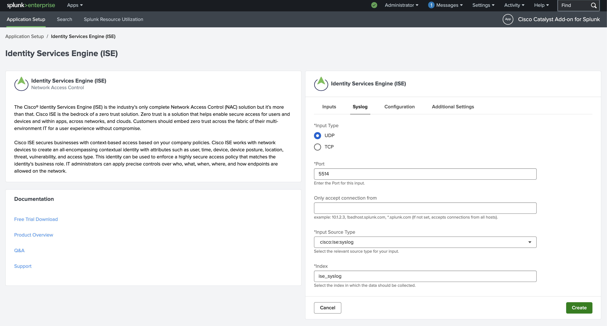

---

### Cisco Catalyst Center
On the Splunk UI navigate to the Cisco Catalyst Add-on for Splunk and click on **"Configure Application"** on the Catalyst Center tile.  

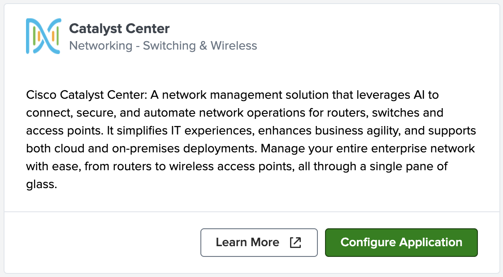

Navigate to the **"Configuration"** tab and click **"Add"**  
In the pop up, input the API credentials for Catalyst Center
* **Account Name:** Simple Name for Account Settings
* **Cisco Catalyst Center Host:** \<IPAddress/Hostname with leading https:\\\\\>
* **Username:** \<API User Account\>   
* **Password:** \<API User Password\>   

  

Navigate to the **"Inputs"** tab and select the **"Input Type"** dropdown and select **"Reports"**  and input the requested parameters.  
* **Input Type:** Reports
* **Name:** Simple Name for Input
* **Interval:** \<Interval in Seconds\> (14400 default, Match Interval of Reports when built, typically once daily or 86400)
* **Index:** \<Index previously configured\>
* **Cisco Catalyst Center Account:** Select the \<Account Name\> from the [**Configuration Tab**](#cisco-catalyst-center) step 
* **Device Inventory Report Name:** \<Inventory Report Name\> from [**Create Catalyst Center Reports**](#create-catalyst-center-reports) step
* **Device Compliance Report Name:** \<Compliance Report Name\> from [**Create Catalyst Center Reports**](#create-catalyst-center-reports) step

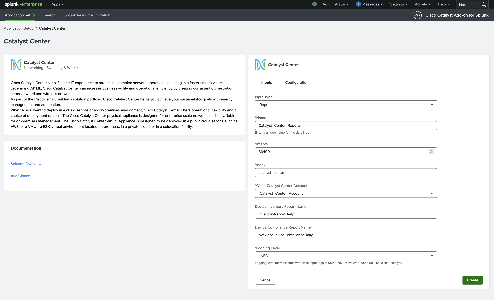  

---

### Tenable Add-On
On the Splunk UI navigate to the Tenable Add-on for Splunk.
Configure the Add-On for Tenable Security Center using the public Tenable Documentation.  
[https://docs.tenable.com/integrations/Splunk/Content/Splunk2/Installation.htm](https://docs.tenable.com/integrations/Splunk/Content/Splunk2/Installation.htm)

---

# Search Macros

### Understanding Splunk Search Macros

#### What is a Search Macro?
A search macro is a reusable building block of **Search Processing Language (SPL)**. Think of it as a "shortcut" or a "variable" that stores a complex string of code, a specific filter, or a set of instructions. Instead of typing the same code into dozens of different saved searches, you define it once in a macro and reference it elsewhere.

In Splunk, macros are always referenced by surrounding the macro name with **backticks**, like this: 
`` `cisco_catalyst_app_index` ``

#### How Macros are Used in Splunk

1.  **Centralized Management (The "Change Once, Update Everywhere" Principle)**
    The primary benefit of macros is maintenance. For example, if a Cisco ISE logs are moved from an index named `old_index` to `new_index`, you don't have to manually edit 50 different saved searches. You simply update the `cisco_catalyst_app_index` macro once, and every search using that macro is instantly updated.

2.  **Simplifying Complex Logic**
    Macros can hide "ugly" or complex code—such as long Regular Expressions (regex) used for parsing security posture—making the actual saved searches much easier to read and audit. 
    *   *Example:* Instead of seeing a 100-character regex string in a search, a user sees `` `cisco_catalyst_posture_regex_malware` ``.

3.  **Ensuring Consistency**
    Macros ensure that every dashboard and report in an app is looking at the exact same data. By using a macro like `cisco_catalyst_app_sourcetypes`, you guarantee that the "Total Endpoint Count" dashboard and the "Compliance Report" are both querying the same set of devices.

4.  **Environment Customization**
    Macros allow a single Splunk App to be "portable." When the Cisco Catalyst App is installed in a new environment, the administrator uses the `macros.conf` file to "tune" the app to the specific network without breaking the underlying search logic.

#### Macro Anatomy in the Cisco Catalyst App
In the Cisco Catalyst App, the macros generally fall into three functional types:
*   **Definitions**: Defining where data lives (Indexes and Sourcetypes).
*   **Filters**: Defining specific Plugin IDs (Tenable) or Category names (CYBERCOM).
*   **Parsers**: Defining the Regex patterns used to extract pass/fail results from raw text logs.

---

### Data Scoping Macros

*   **`cisco_catalyst_app_index`**
    *   **Purpose**: Defines the Splunk index(es) where all relevant data (ISE, SD-WAN, Tenable, etc.) is stored.
    *   **Used In**: Generally used in all searches or dashboards to narrow down the dataset to relevant data indexes.
    *   **How to Modify**: By default, it searches all indexes (`*`). **For better performance and security, change this to specific indexes.**
        *   *Example*: Definition = index IN ("ise_syslog","ise_analytics","catalyst_center","tenable")
    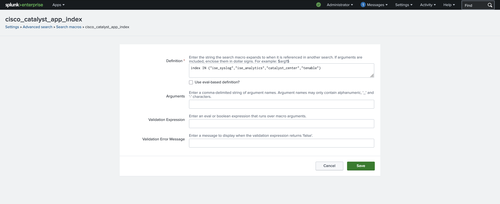  
*   **`cisco_catalyst_app_sourcetypes` Leave at Default**
    *   **Purpose**: Filters searches to only include specific sourcetypes related to the Cisco ecosystem and Tenable.
    *   **Used In**: Generally used in all searches or dashboards to narrow down the dataset to relevant sourcetypes.
    *   **How to Modify**: If using a custom sourcetype for data inputs (e.g., `cisco:ise:custom`), add it to the list.
        *   *Example*: Definition = sourcetype IN ("cisco:ise*", "cisco:sdwan*", "cisco:dnac*", "stream:netflow", "cisco:cybervision:*","meraki:*", "cisco:ios", "cisco:thousandeyes:test", "cisco:sgacl:logs","cisco:catalyst:center:*", "cisco:ise:analytics*", "tenable:sc*")
    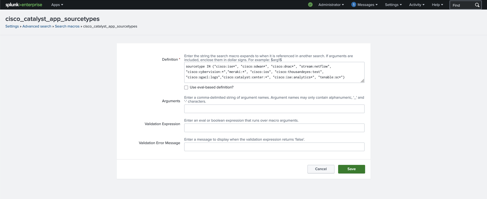  
*   **`summariesonly` Optional**
    *   **Purpose**: Controls whether searches pull data from Data Model acceleration summaries or raw data.
    *   **Used In**: Almost every search starting with `| tstats`.
    *   **How to Modify**: Set to `true` to significantly speed up dashboards if Data Model acceleration is turned on.
        *   *Example*: `Definition = summariesonly=true`
    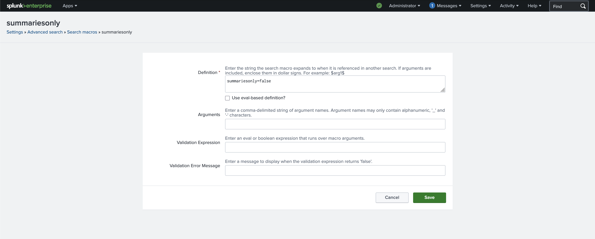

---

### Posture & Compliance Regex Macros
These macros use Regular Expressions to parse the results of security checks from raw ISE syslog messages in MESSAGE_CODE 87000 & 87001.

*   **Macros**: 
    * `cisco_catalyst_posture_ruleResultEncrypt`
    * `cisco_catalyst_posture_ruleResultFirewall`
    * `cisco_catalyst_posture_ruleResultPatch`
    * `cisco_catalyst_posture_ruleResultUSB`
    * `cisco_catalyst_posture_ruleResultEndpointApp`
    * `cisco_catalyst_posture_ruleResultPKIRoots`
    * `cisco_catalyst_posture_ruleResultEndpointMonitor`
    * `cisco_catalyst_posture_ruleResultPatching`
    * `cisco_catalyst_posture_ruleResultMalware`
    * `cisco_catalyst_posture_ruleResultOwnorg`
    * `cisco_catalyst_posture_ruleResultAdminorg`
    * `cisco_catalyst_posture_ruleResultCcsafa`
    * `cisco_catalyst_posture_ruleResultCndsp`
    * `cisco_catalyst_posture_ruleResultCocomaor`
    * `cisco_catalyst_posture_ruleResultGeolocation`
    * `cisco_catalyst_posture_ruleResultOpAccreditation`
*   **Used In**: `cisco_catalyst_ise_posture_report`.
*   **How to Modify**: These depend on the naming convention of the Posture Policies in Cisco ISE and assume that multiple `PostureReport` values come in from Syslog, 1 for each Macro. If the policies are named `CORP_Antivirus` instead of `C2C_AntiMalware`, the regex must be updated. It is recommended to Not change the extracted variable name enclosed in the `(?<>)`
    *   *Example*: 
        *   Using Search look at a raw posture log using `index=<syslog_index> MESSAGE_CODE=87000` and look for the PostureReport elements.
            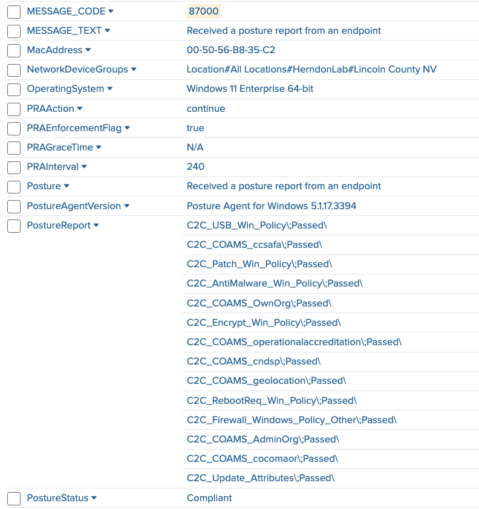
        *   The Posture Macros expect to Regex conditions. One for matching the name of the posture policy, the other for extracting the result (Passed/Failed).
        *   To match the example of C2C_Encrypt_Win_Policy we would update the definition = `"C2C_Encrypt_\w+_Policy=(?<ruleResultEncrypt>[\w]*)"`
            *   The `C2C_Encrypt_\w+_Policy` matches any policy name that starts with C2C_Encrypt_\<any word value\>_Policy and the Passed/Failed result is stored in the app as `ruleResultEncrypt` variable for later use in the reports. 

---

### Categorization Macros

#### cisco_catalyst_CYBERCOM_Macro
*   **Purpose**: Defines the list of official device categories.
*   **Used In**: 
    * `cisco_catalyst_profiler_summary`
*   **How to Modify**: Add or remove categories to match the organization's specific device classification standards. Ensure that no spaces are on the leading or trailing of each Logical Profile in the definition.
    *   *Example*: Definition = "(Workstations|Servers|Printers|Medical Devices)"
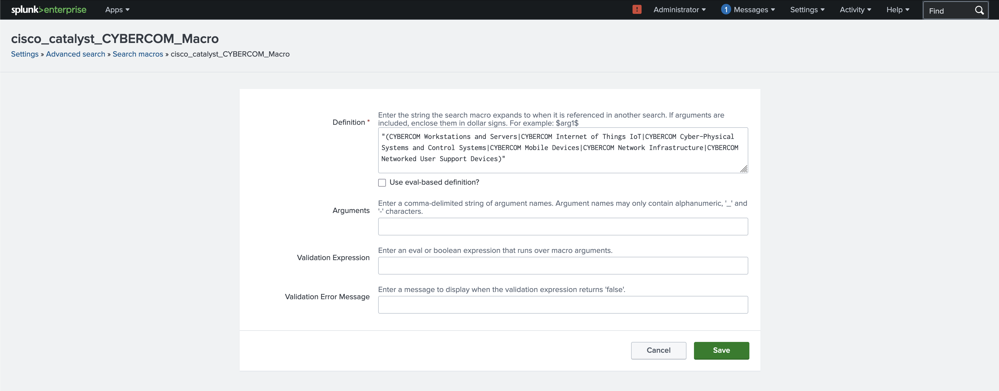

#### cisco_catalyst_CYBERCOM_Unknown
*   **Purpose**: The fallback label for devices that haven't been profiled.
*   **Used In**: 
    * `cisco_catalyst_profiler_summary`
*   **How to Modify**: Change the string if a different label like "Unclassified" or "Pending".

---

### Reporting & Metadata Macros
These macros provide additional matching value information for compliance reports.

*   **Macros**: 
    * `cisco_catalyst_access_level_deny`
    * `cisco_catalyst_manageable_logical_filter`
    * `cisco_catalyst_manageable_profile_filter`
*   **Used In**: ``
*   **How to Modify**: These **must** be changed for every installation to match the names of the Authorization Policies, Logical Profiles, and Device Profiles for your environment.


---

### Access Level Mapping Macros

#### cisco_catalyst_access_level_full
*   **Purpose**: Defines the string used in ISE Authorization Policies to indicate a device has full network access.
*   **Used In**: ``
*   **How to Modify**: Change this to match Authorization Profile names in ISE. It can be a partial or full match. Entries in the macro MUST be lower case only.
    *   *Example1*: Definition = "permitaccess"
    *   *Example2*: If multiple Authorzation Policies indicate full network access, Definition = "(permitaccess|compliant|fullaccess|*etc*)"

#### cisco_catalyst_access_level_limited
*   **Purpose**: Defines the string used in ISE Authorization Policies to indicate a device has limited network access
*   **Used In**: ``
*   **How to Modify**: Change this to match Authorization Profile names in ISE. It can be a partial or full match. Entries in the macro MUST be lower case only.
    *   *Example1*: Definition = "limited"
    *   *Example2*: If multiple Authorzation Policies indicate limited network access, Definition = "(posture|quarantine|remediation|limited|*etc*)"

#### cisco_catalyst_access_level_deny
*   **Purpose**: Defines the string used in ISE Authorization Policies to indicate a device has been denied network access
*   **Used In**: ``
*   **How to Modify**: Change this to match Authorization Profile names in ISE. It can be a partial or full match. Entries in the macro MUST be lower case only.
    *   *Example1*: Definition = "deny"
    *   *Example2*: If multiple Authorzation Policies indicate limited network access, Definition = "(deny|denied|*etc*)"

---

### Tenable Plugin Macros
These macros define the specific Tenable Plugin IDs used to extract hardware and software details.

*   **Macros**: 
    * `cisco_catalyst_windows_installed_plugin`
    * `cisco_catalyst_windows_disk_info_plugin`
    * `cisco_catalyst_windows_comp_prod_info_plugin`
    * `cisco_catalyst_windows_network_int_plugin`
    * `cisco_catalyst_windows_memory_info_plugin`
    * `cisco_catalyst_windows_processor_info_plugin`
    * `cisco_catalyst_windows_TPM_info_plugin`
    * and the corresponding `other` (Linux/Unix) versions.
*   **Used In**: All Tenable-specific searches (e.g., `cisco_catalyst_windows_os_details_v2`, `cisco_catalyst_other_hardware_details_v2`).
*   **How to Modify**: These values **must** be updated in every environment as the custom plugins get assigned a unique number upon import to the Tenable Security Center.
    *   *Example*: `definition = Cisco_Catalyst_Dataset.Cisco_Catalyst_Tenable.tenable_plugin_id="999999"`

---

# Cisco ISE Network Device Groups Lattitude and Longitude Mapping
If you are planning to use the GeoStats Maps view on the Dashboard Overview tab the Splunk Lookup Table will need to be updated with your ISE Network Device Group names and a latitude and longitude value for accurate placement.  
To properly place the counts on the geo-stats map you will need the **Network Device Group**
The following is an example of how to edit the lookup file located at:   
    `/opt/splunk/etc/apps/cisco-catalyst-app/lookups/cisco_catalyst_ise_location_mapping.csv`  
    
    Location,lat,lon
    Location#All Locations#HerndonLab#Lincoln County NV,37.2343,-115.8066
    Location#All Locations#HerndonLab#Ashburn,39.0438,-77.4874
    Location#All Locations#HerndonLab#Denver,39.7392,-104.9903
    Location#All Locations#HerndonLab#Honolulu,21.3099,-157.8581
    Location#All Locations#HerndonLab#Tempe,33.4255,-111.9400
    Location#All Locations#HerndonLab#Washington DC,38.9072,-77.0369
    Location#All Locations#Home Office,51.5072,-0.1180
If you don’t wish to plot individual Device Groups you can use the Wildcard option detailed below. Update the Lookup Table to reflect the single LAT/LON that you want all devices associated with:  
    `/opt/splunk/etc/apps/cisco-catalyst-app/lookups/cisco_catalyst_ise_location_mapping.csv`  

    Location,lat,lon  
    Location#All Locations*,37.2343,-115.8066  

---

# Cisco Enterprise Networking for Splunk Platform App
The Cisco Enterprise Networking for Splunk Platform App has been updated to include additional dashboards and views for endpoint compliance and reporting. Many of these views have been tailored to specific requirements of the DoW Comply to Connect (C2C) program while also having many uses in other customer segments as well. All of the data inputs configured above are required for the **Analytics Reports** and **Detailed Reports** navigations within the app.  

---

## Analytics Reports Menu
### Overview Reports
This view provides high level information on Activity Location, Device Classification, Authentication, Device Compliance, and Infrastructure.   
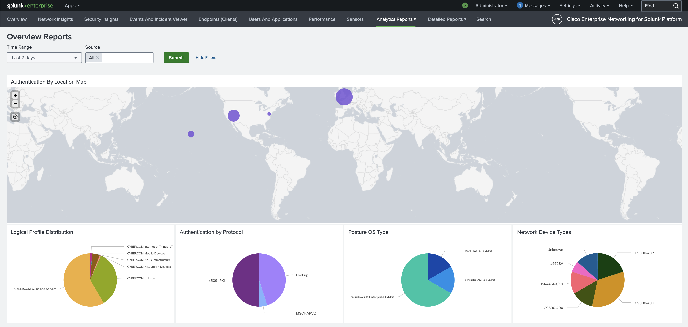

### Endpoint Compliance
This view provides total count of Compliant/NonCompliant devices and the specific requirements that are failing from Cisco ISE Syslog and Analytics Report Inputs. Additionally, it provides a trend of compliance over time and details of compliance for every device found on the network. All failing devices are brought to the top of the list for easy identification while the list is also searchable using device MAC address.  
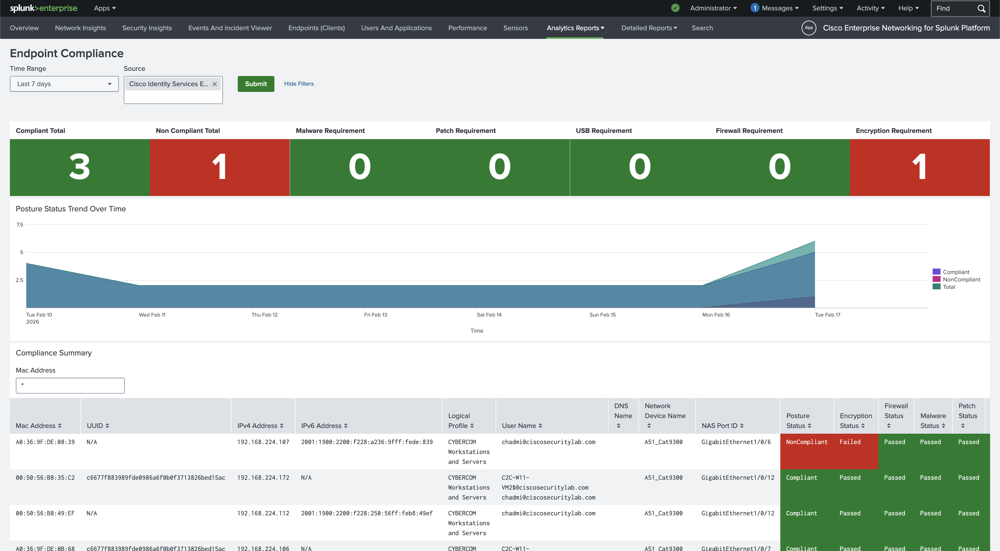

### Network Compliance
This view provides Network Device Inventory and Compliance with specifics from Cisco Catalyst Center Reports Inputs. All devices Cisco & Third party that are managed or monitored with Cisco Catalyst Center will be shown here.  
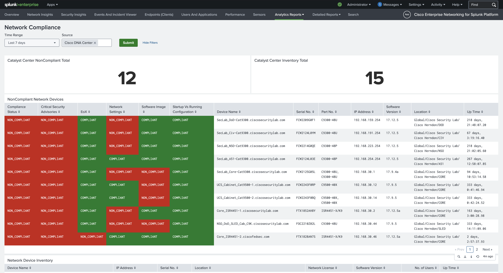

### Master Endpoint Record
This view is the output of the [master report](#master-aggregator-report) that runs on an interval to gather & correlate all the data elements required for reporting. This report will show every endpoint and all of the data elements that have been gathered for each.  
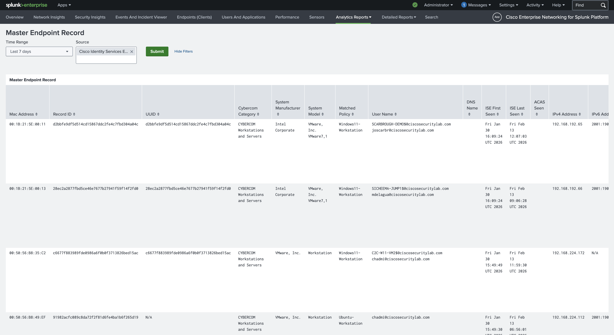

## Detailed Reports Menu
### Step 1 - Device Classification
This report provides views of the C2C 0.1.0 (Device Categorization) & 0.1.1(Operating System Summary) requirements.  
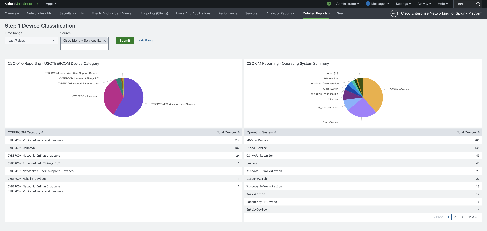

### Step 2 - Manageability and Compliance
This report provides views of the C2C 0.2.0-0.2.24 requirements. This includes Discovery, Manageability, MAB vs 802.1X, Compliance, and other elements.  
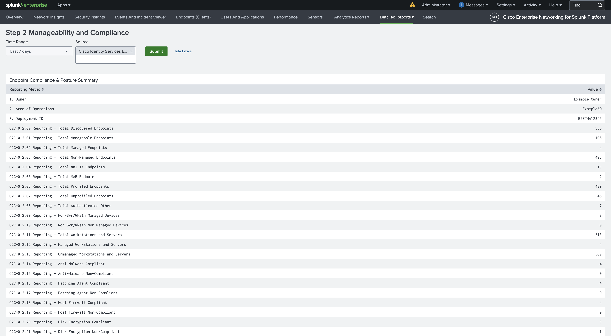

### Step 3 - Compliance Remediation
This report provides results of remediation attempts on all endpoints that required any attempt at remediation.  
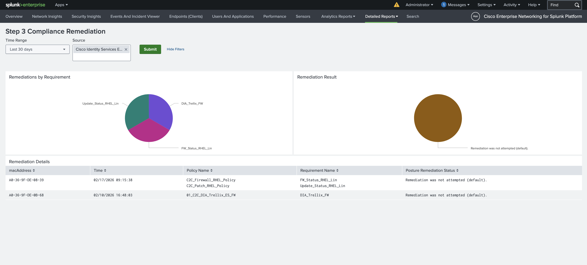

### Step 4 - ICAM Summary
This report provides Identity and Credential Access Management (ICAM) data for every endpoint that uses/used credentials to access the network. It presents the access results, number of attempts over time and identity details where available.  
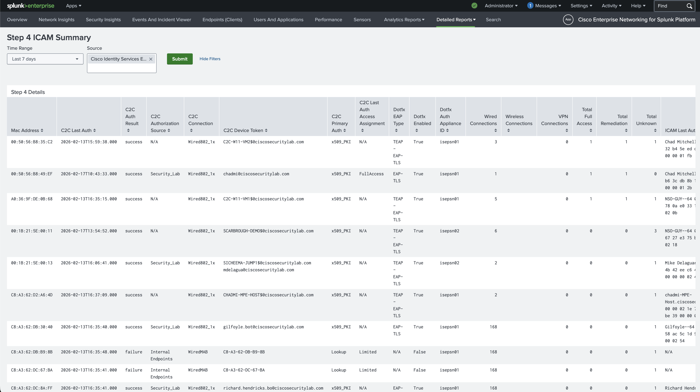

### Implementation Metrics
This view provides KPI metrics based on the C2C program office Goals and Calculations.  
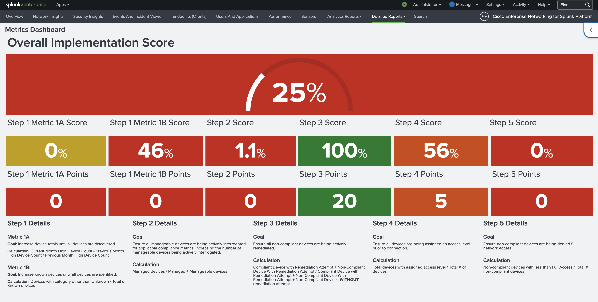

---

# Required for endpoints over 10,000 Endpoints
In the event that the evironment for Analytics reporting exceeds 10,000 endpoints this will encounter a default limit on Splunk which limits Search results to 10,000 records.  

### Modify cisco_catalyst_kv_view Using "sort 0"
Adding a "sort 0" to the time sorting on the Master Search named `cisco_catalyst_kv_view` can override the default limits.  
* Navigate to *Settings > Searches, reports, and alerts*  
* Select App: *Cisco Enterprise Networking for Splunk Platform(cisco-catalyst-app)*
* Select Owner: *All*
* Filter for, or locate the *cisco_catalyst_reports_lookup* report
* Click *Edit* and *Edit Search*
* Scroll to bottom of search and add a **0 (Zero Digit)** between the *sort* and *data_quality_score* command like the example below
```
...  
| sort 0 - data_quality_score  
...  
```

---

# Change Navigation to only show Comply to Connect (C2C) Views - Optional  

### Create the local UI Navigation folder structure.
`mkdir -p /opt/splunk/etc/apps/cisco-catalyst-app/local/data/ui/nav/`  

### Copy the current default.xml from default to local
`cp /opt/splunk/etc/apps/cisco-catalyst-app/default/data/ui/nav/default.xml /opt/splunk/etc/apps/cisco-catalyst-app/local/data/ui/nav/default.xml`  

### Edit the local copy of the default.xml
`vi /opt/splunk/etc/apps/cisco-catalyst-app/local/data/ui/nav/default.xml`  

```
<nav search_view="search">
  <collection label="Analytics Reports">
  <view name="overview_analytics_reports" default='true' />
  <view name="endpoint_compliance_analytics_reports" />
  <view name="network_compliance_analytics_reports" />
  <view name="master_endpoint_record_analytics_reports" />
  </collection>
  <collection label="Detailed Reports">
  <view name="step_1_report" label="Step 1 Device Classification"/>
  <view name="step_2_report" label="Step 2 Manageability and Compliance"/>
  <view name="step_3_report" label="Step 3 Compliance Remediation"/>
  <view name="step_4_report" label="Step 4 ICAM Summary"/>
  <view name="metrics_dashboard" label="Implementation Metrics"/>
  </collection>
  <view name="search"/>
</nav>
```
*Note: If you wish for the default page to be other than the Overview, move the **default='true'** to the view that you want to be the default.*

### Reload the Splunk Web UI
Using your web browser input **http/s://<IPAddress/Hostname>:8000/debug/refresh** and then click the **Refresh** button.  
Once the process completes reload browser where the App is loaded and the nav structure should have changed.

---

# APPENDIX
## Reports / Saved Searches

> **v3.2 Saved Search Timing and KV Store Pipeline**
>
> Version 3.2 uses a staged pipeline model. Core ISE/Tenable enrichment saved searches write intermediate results to `stage_*.csv` lookups on a frequent schedule (primarily every 15 minutes), and `cisco_catalyst_kv_update` runs every 10 minutes at minute offsets `3,13,23,33,43,53` to upsert the latest endpoint record into the KV Store (`cisco_catalyst_assets_lookup`).
>
> Not all searches run every 15 minutes. Some support searches run hourly, every 8 hours, daily, or every 24 hours (for example, location/SD-WAN/Meraki mapping and the assets reaper).

### Lookup Builders & Discovery

*   **`cisco_catalyst_location`**
    *   **Description**: Builds and refreshes the ISE location lookup template used for Network Device Group mapping.
    *   **Key Commands**:
        * `tstats` (collects authentication and device event locations)
        * `coalesce/append/outputlookup` (normalizes and preserves historical location values)
    *   **Tuning**: If location values are missing in reports, verify both authentication and device-location fields are populated in the datamodel.
*   **`cisco_catalyst_sdwan_netflow`**
    *   **Description**: Populates SD-WAN application tag lookup mappings.
    *   **Key Commands**:
        * `tstats` (pulls app + app_tag pairs)
        * `outputlookup append=true` (incrementally updates tag mapping)
*   **`cisco_catalyst_sdwan_policy`**
    *   **Description**: Populates SD-WAN policy and policy-rule lookup mappings.
    *   **Key Commands**:
        * `append` (combines firewall policy and class-ID sources)
        * `outputlookup key_field=key` (stores reusable policy map)
*   **`cisco_catalyst_meraki_organization_mapping`**
    *   **Description**: Maintains Meraki organization ID-to-name lookup values.
    *   **Key Commands**:
        * `tstats` (extracts organization identifiers from Meraki events)
        * `table/outputlookup` (writes normalized lookup rows)
*   **`cisco_catalyst_meraki_devices_serial_mapping`**
    *   **Description**: Maintains Meraki sensor serial-to-name/model lookup values.
    *   **Key Commands**:
        * `rename/table/dedup` (normalizes serial metadata)
        * `outputlookup` (publishes serial mapping CSV)

---

### ISE Analytics and Syslog Reports

*   **`cisco_catalyst_profiler_summary`**
    *   **Description**: Builds endpoint identity/profile context from ISE Full Reports and stages it for aggregation.
    *   **Key Commands**:
        * `makemv/mvfilter` (normalizes multi-value CYBERCOM categories)
        * `strftime/strptime` (converts ISE timestamps to ISO format)
        * `outputlookup stage_cisco_ise_profiler_summary.csv`
*   **`cisco_catalyst_ise_passed_authn`**
    *   **Description**: Stages passed authentication attributes including auth source, auth method, ICAM, and access assignment.
    *   **Key Commands**:
        * `rex` (extracts VPN MAC and auth context from `av_pair`)
        * `case` (derives user-friendly auth/access fields)
        * `outputlookup stage_cisco_ise_passed_authn.csv`
*   **`cisco_catalyst_ise_accounting`**
    *   **Description**: Stages IP addressing and connection counters from ISE accounting events.
    *   **Key Commands**:
        * `rex` (extracts accounting event timestamp)
        * `eval` (derives wired/wireless/VPN counts)
        * `outputlookup stage_cisco_ise_accounting.csv`
*   **`cisco_catalyst_ise_access_levels`**
    *   **Description**: Stages per-endpoint full/limited/unknown access counts based on authorization policy matching.
    *   **Key Commands**:
        * `chart/addtotals` (rolls up access-level totals)
        * `foreach` (applies macro-based access classification)
        * `outputlookup stage_cisco_ise_access_levels.csv`
*   **`cisco_catalyst_ise_posture_report`**
    *   **Description**: Stages endpoint posture status and rule extraction results from posture tuples.
    *   **Key Commands**:
        * `mvexpand/rex` (parses posture tuple content into rule result fields)
        * `stats latest(...)` (reassembles most recent endpoint state)
        * `outputlookup stage_cisco_ise_posture.csv`
*   **`cisco_catalyst_ise_manageability`**
    *   **Description**: Derives a managed/managable/unmanagable state from identity, auth, and posture context.
    *   **Key Commands**:
        * `inputlookup` (uses aggregated endpoint record)
        * `case` (computes manageability label)
        * `outputlookup stage_cisco_ise_manageability.csv`
*   **`cisco_catalyst_ise_posture_remediation`**
    *   **Description**: Stages posture remediation attempt summaries by endpoint, policy, and requirement.
    *   **Key Commands**:
        * `stats` (builds first/last seen and remediation counts)
        * `mvjoin` (creates compact remediation summary string)
        * `outputlookup stage_cisco_ise_posture_remediation.csv`
*   **`cisco_catalyst_ise_hardware_report`**
    *   **Description**: Stages ISE hardware inventory attributes (memory, disk, BIOS, CPU).
    *   **Key Commands**:
        * `eval` (normalizes memory/disk units)
        * `fields` (publishes standardized hardware keys)
        * `outputlookup stage_cisco_ise_hardware.csv`
*   **`cisco_catalyst_coams_report`**
    *   **Description**: Stages DoD COAMS/organizational attributes from ISE registry reports.
    *   **Key Commands**:
        * `rex/ltrim` (extracts and normalizes numeric org attributes)
        * `outputlookup stage_cisco_ise_device_coams.csv`

---

### Tenable Asset Intelligence (Windows & Other)

These searches use `tstats` against Tenable datamodel events and normalize output into staged lookup files for endpoint aggregation.

*   **`cisco_catalyst_tenable_osarch_details`**
    *   **Description**: Extracts OS identity and architecture for Windows and Other platforms into a unified schema.
    *   **Key Commands**:
        * `case` (switches plugin parsing mode by plugin ID)
        * `rex` (parses vendor, version, CPE, architecture, release)
        * `outputlookup stage_tenable_osarch_detail.csv`
*   **`cisco_catalyst_tenable_disk_details`**
    *   **Description**: Extracts and normalizes boot partition size/free values for Windows and Other systems.
    *   **Key Commands**:
        * `rex` (extracts Windows and Other disk text formats)
        * `case/coalesce` (normalizes unit conversions and common fields)
        * `outputlookup stage_tenable_disk_detail.csv`
*   **`cisco_catalyst_tenable_hardware_details`**
    *   **Description**: Extracts BIOS/system inventory details (GUID, vendor, product, version, serial).
    *   **Key Commands**:
        * `rex` (platform-specific hardware extraction)
        * `outputlookup stage_tenable_system_detail.csv`
*   **`cisco_catalyst_tenable_interface_details`**
    *   **Description**: Extracts NIC vendor and product names from Windows and Other interface plugins.
    *   **Key Commands**:
        * `rex max_match=0` (captures multiple NIC values)
        * `outputlookup stage_tenable_interface_detail.csv`
*   **`cisco_catalyst_tenable_memory_details`**
    *   **Description**: Extracts and normalizes total physical memory values.
    *   **Key Commands**:
        * `rex` (parses source-specific memory values)
        * `eval TotalPhysicalMemory=...*1024`
        * `outputlookup stage_tenable_memory_detail.csv`
*   **`cisco_catalyst_tenable_processors_detail`**
    *   **Description**: Extracts CPU version, installed CPU count, and total core count.
    *   **Key Commands**:
        * `rex max_match=0` (captures all CPU/core occurrences)
        * `mvcount/eventstats` (computes installed CPU and total cores)
        * `outputlookup stage_tenable_processor_detail.csv`
*   **`cisco_catalyst_tenable_tpm`**
    *   **Description**: Extracts TPM manufacturer and version details from Windows TPM plugin output.
    *   **Key Commands**:
        * `rex` (extracts TPM fields)
        * `outputlookup stage_tenable_tpm_detail.csv`
*   **Tuning**: If Tenable plugin output formats or plugin IDs change, update the corresponding `rex` patterns and plugin-ID macros before relying on staged outputs.

---

### Step Reporting

#### Step 1: Visibility
* **`cisco_catalyst_profiler_summary`**: Provides profiled endpoint visibility (identity, CYBERCOM category, matched policy, reporting source).

#### Step 2: Management
* **`cisco_catalyst_ise_manageability`**: Derives managed/managable/unmanagable endpoint status.
* **`cisco_catalyst_ise_access_levels`**: Computes full/limited/unknown access-level counts per endpoint.

#### Step 3: Remediation
* **`cisco_catalyst_ise_posture_remediation`**: Summarizes remediation attempts and outcomes from posture remediation events.

#### Step 4: Access Control
* **`cisco_catalyst_ise_passed_authn`**: Builds last-auth access assignment, auth source/type, and ICAM details.
* **`cisco_catalyst_ise_accounting`**: Adds endpoint IP and connection-type telemetry used in access control context.

---

### Master Endpoint Record Aggregator & Implementation Scoring

#### Master Aggregator Report
*   **`cisco_catalyst_kv_update`**
    *   **Description**: The primary aggregation search for v3.2. It appends all staged ISE/Tenable/resolution datasets, keeps latest values per `macAddress`, and writes to KV Store.
    *   **Schedule**: Every 10 minutes at minute offsets `3,13,23,33,43,53`.
    *   **Key Commands**:
        * `append` (combines staged lookup datasets)
        * `stats latest(*) by macAddress` (builds master endpoint record)
        * `outputlookup ... cisco_catalyst_assets_lookup` (persists endpoint master record)
    *   **Tuning**: This is a high-impact search. Keep staging searches healthy and monitor runtime when reducing interval below 10 minutes.
*   **`cisco_catalyst_assets_reaper`**
    *   **Description**: Purges aged endpoints from KV Store based on the `cisco_catalyst_kv_age_out` macro.
    *   **Key Commands**:
        * `relative_time` (applies age-out threshold)
        * `outputlookup key_field=_key` (rewrites pruned KV contents)

#### Master Endpoint Record Report and Output for CMRS reporting add-on
*   **`cisco_catalyst_kv_view`**
    *   **Description**: Produces a scored endpoint completeness view from KV Store, then exports to CSV for reporting workflows (including CMRS option).
    *   **Key Commands**:
        * `eval score_*` (computes domain-level data quality components)
        * `eval data_quality_pct/data_quality_tier` (builds completeness score and tier)
        * `table/fillnull` (publishes analyst-ready report fields)
*   **`cisco_catalyst_ip_dns_resolve`**
    *   **Description**: Enriches missing IP or DNS values and stages resolution output used by `cisco_catalyst_kv_update`.
    *   **Key Commands**:
        * `lookup dnslookup` (forward/reverse DNS correlation)
        * `coalesce` (selects best resolved IP/DNS values)
        * `outputlookup stage_resolvedIpDns_detail.csv`

---

## SyslogNG Configuration for ISE Syslog over 8192 bytes

### Check & Set SELINUX Permissions. Use TCP or UDP example based on desired output from ISE.
```
semanage port --list | grep syslog
semanage port -a -t syslogd_port_t -p udp 5514 <!UDP Syslog Example - Replace with your Syslog port>
semanage port -a -t syslogd_port_t -p tcp 5514 <!TCP Syslog Example - Replace with your Syslog port>
```

### Create Directory for ISE Logs in /var/log
`mkdir /var/log/ise`

Add file below in /etc/syslog.ng/conf.d/. Chage comment on 'source', 'port', 'owner', 'group', and 'log' lines to match your environment  
`vi /etc/syslog-ng/conf.d/cise.conf`  
[**Download cise.conf**](static/file/cise.conf)

```
source s_ise_udp { udp(ip(0.0.0.0) port(5514)); };
# source s_ise_tcp { tcp(ip(0.0.0.0) port(5514)); };
destination d_ise { file("/var/log/ise/${HOST}/${HOST}.log" create-dirs(yes) perm(0644) owner("splunk") group("splunk") dir_perm(0755)); };

# Parsers
block parser cisco-ise-parser() {
    channel { 
        parser {
            csv-parser(columns('1','2','3','MSG') flags(greedy));
            grouping-by(
                        scope("host")
                        key("$1")
                        sort-key('$3')
                        trigger("$(context-length)" eq "$2")
                        timeout(30)
                        aggregate(
                            inherit-mode(last-message)
                            #value("MESSAGE", '$(if "$(context-length) eq $2"  truncated)')
                            value("MESSAGE", "$(if ('$(context-length)' eq '$(+ $2 1)') 
                                                        '$1 1 0 $(implode \" \" $(list-slice :-1 $(context-values $MSG)))'
                                                        '$1 1 0 SYSLOG TRUNCATED $(list-slice :-1 $(context-values $3-$MSG))')")
                            tags(".cise.joined_message"))
            );
        };
        filter { tags(".cise.joined_message"); };
    };
};
log { source(s_ise_udp); parser {cisco-ise-parser()}; destination(d_ise); };
# log { source(s_ise_tcp); parser {cisco-ise-parser()}; destination(d_ise); };
```

### Restart SyslogNG for configuration to be loaded
`systemctl restart syslog-ng`  

Then verify status  
`systemctl status syslog-ng`
