# Comply to Connect Reporting with the Cisco Enterprise Networking for Splunk Platform App
### Executive Summary

**Comply to Connect (C2C)** is a critical program, especially for the Department of Defense (DoD), serving as a bridge to Zero Trust access. It automates the process of controlling which devices are allowed to authenticate and connect to the DoD Information Network (DoDIN). C2C ensures that devices are automatically remediated if found non-compliant and provides comprehensive reporting and visibility throughout the process. This program lays the groundwork for Zero Trust by establishing inventory and endpoint health as foundational elements, enabling consistent policy enforcement and behavior attribution to users and devices.

Cisco’s Identity Services Engine (ISE) plays a central role in C2C by providing:

- **Discovery and Identification:** Automated detection, identification, and categorization of all endpoints connecting to the network.
- **Interrogation:** Compliance posture verification through device scanning and posture assessment.
- **Auto-Remediation:** Automated remediation actions to bring devices into compliance with minimal user impact.
- **Authorization:** Granular access control based on device/user profiles, enforcing least privilege and network segmentation.
- **Situational Awareness and Enforcement:** Continuous monitoring and re-authentication to maintain compliance throughout the session.

This structured approach not only meets C2C requirements but also forms the foundation for a Zero Trust architecture by enabling continuous trust verification and dynamic policy enforcement.

### Importance of Monitoring and Reporting 

Monitoring and reporting are essential components of both Comply to Connect and Zero Trust frameworks. Continuous visibility into all devices and their compliance status allows organizations to:

- Detect and respond to changes in device posture or behavior in real time.
- Maintain situational awareness to enforce policies dynamically.
- Provide detailed, customizable reporting and dashboards that offer clear insights into compliance progress and security posture.
- Facilitate rapid remediation and minimize operational impact through automated workflows and open APIs for integration with other security tools.

By integrating monitoring and reporting, organizations can ensure that trust is continuously verified, risks are minimized, and security policies are enforced consistently across all network access points, which is fundamental to the effectiveness of Zero Trust security. Splunk is a critical component in supporting Comply to Connect (C2C) and Zero Trust frameworks by delivering comprehensive monitoring and reporting capabilities. It provides continuous visibility across users, devices, and infrastructure, enabling real-time verification of security posture and compliance. By integrating data from diverse sources, Splunk offers advanced analytics and machine learning to detect anomalies and prioritize responses effectively. Its automation and orchestration features reduce manual effort and accelerate incident handling, ensuring enforcement of zero trust policies. Additionally, Splunk’s customizable reporting supports regulatory compliance requirements such as FedRAMP and DoD mandates. With scalable deployment options across on-premises and cloud environments, Splunk enhances security operations by empowering teams to maintain continuous trust and resilience within Zero Trust architectures. Together, Cisco and Splunk deliver the visibility, analytics, and automation essential for effective monitoring and reporting in C2C and Zero Trust implementations.  

---
- [Comply to Connect Reporting with the Cisco Enterprise Networking for Splunk Platform App](#comply-to-connect-reporting-with-the-cisco-enterprise-networking-for-splunk-platform-app)
    - [Executive Summary](#executive-summary)
    - [Importance of Monitoring and Reporting](#importance-of-monitoring-and-reporting)
- [Prerequisites](#prerequisites)
- [Communications](#communications)
- [Splunk Cisco Enterprise Networking Application and Technical Add-Ons Installation](#splunk-cisco-enterprise-networking-application-and-technical-add-ons-installation)
    - [Download App and TAs](#download-app-and-tas)
    - [Install Reporting App and TAs on Splunk Server](#install-reporting-app-and-tas-on-splunk-server)
    - [Add props.conf for Syslog Truncate](#add-propsconf-for-syslog-truncate)
      - [Create a local **props.conf** in the **local** directory and add following stanza:](#create-a-local-propsconf-in-the-local-directory-and-add-following-stanza)
- [Cisco Identity Services Engine Configuration](#cisco-identity-services-engine-configuration)
    - [Configure ISE Syslog](#configure-ise-syslog)
    - [Configure ISE Repositories](#configure-ise-repositories)
    - [ISE Analytics CLI Account and Host Key Configuration](#ise-analytics-cli-account-and-host-key-configuration)
- [Cisco Catalyst Center Configuration - Optional](#cisco-catalyst-center-configuration---optional)
    - [Create Catalyst Center Reports](#create-catalyst-center-reports)
    - [Create API User](#create-api-user)
    - [Create Scheduled Reports](#create-scheduled-reports)
      - [Compliance Report](#compliance-report)
      - [Inventory Report](#inventory-report)
- [Splunk Reporting Application Configuration](#splunk-reporting-application-configuration)
    - [Create Indexes on Splunk](#create-indexes-on-splunk)
  - [Create Inputs in the Cisco Catalyst Add-on for Splunk](#create-inputs-in-the-cisco-catalyst-add-on-for-splunk)
    - [Cisco Identity Services Engine](#cisco-identity-services-engine)
      - [Analytics Account Configuration](#analytics-account-configuration)
      - [Analytics Input Configuration](#analytics-input-configuration)
      - [Syslog Configuration](#syslog-configuration)
    - [Cisco Catalyst Center](#cisco-catalyst-center)
    - [Tenable Add-On](#tenable-add-on)
- [Search Macros](#search-macros)
    - [Understanding Splunk Search Macros](#understanding-splunk-search-macros)
      - [What is a Search Macro?](#what-is-a-search-macro)
      - [How Macros are Used in Splunk](#how-macros-are-used-in-splunk)
      - [Macro Anatomy in the Cisco Catalyst App](#macro-anatomy-in-the-cisco-catalyst-app)
    - [Data Scoping Macros](#data-scoping-macros)
    - [Posture \& Compliance Regex Macros](#posture--compliance-regex-macros)
    - [Categorization Macros](#categorization-macros)
      - [cisco\_catalyst\_CYBERCOM\_Macro](#cisco_catalyst_cybercom_macro)
      - [cisco\_catalyst\_CYBERCOM\_Unknown](#cisco_catalyst_cybercom_unknown)
    - [Reporting \& Metadata Macros](#reporting--metadata-macros)
    - [Access Level Mapping Macros](#access-level-mapping-macros)
      - [cisco\_catalyst\_access\_level\_full](#cisco_catalyst_access_level_full)
      - [cisco\_catalyst\_access\_level\_remediation](#cisco_catalyst_access_level_remediation)
    - [Tenable Plugin Macros](#tenable-plugin-macros)
- [Cisco ISE Network Device Groups Lattitude and Longitude Mapping](#cisco-ise-network-device-groups-lattitude-and-longitude-mapping)
- [Cisco Enterprise Networking for Splunk Platform App](#cisco-enterprise-networking-for-splunk-platform-app)
  - [Analytics Reports Menu](#analytics-reports-menu)
    - [Overview Reports](#overview-reports)
    - [Endpoint Compliance](#endpoint-compliance)
    - [Network Compliance](#network-compliance)
    - [Master Endpoint Record](#master-endpoint-record)
  - [Detailed Reports Menu](#detailed-reports-menu)
    - [Step 1 - Device Classification](#step-1---device-classification)
    - [Step 2 - Manageability and Compliance](#step-2---manageability-and-compliance)
    - [Step 3 - Compliance Remediation](#step-3---compliance-remediation)
    - [Step 4 - ICAM Summary](#step-4---icam-summary)
    - [Implementation Metrics](#implementation-metrics)
- [Required for endpoints over 10,000 Endpoints](#required-for-endpoints-over-10000-endpoints)
    - [Modify cisco\_catalyst\_reports\_lookup Using "sort 0"](#modify-cisco_catalyst_reports_lookup-using-sort-0)
    - [Editing App Specific limits.conf for subsearches](#editing-app-specific-limitsconf-for-subsearches)
- [Change Navigation to only show Comply to Connect (C2C) Views - Optional](#change-navigation-to-only-show-comply-to-connect-c2c-views---optional)
    - [Create the local UI Navigation folder structure.](#create-the-local-ui-navigation-folder-structure)
    - [Copy the current default.xml from default to local](#copy-the-current-defaultxml-from-default-to-local)
    - [Edit the local copy of the default.xml](#edit-the-local-copy-of-the-defaultxml)
    - [Reload the Splunk Web UI](#reload-the-splunk-web-ui)
- [APPENDIX](#appendix)
  - [Reports / Saved Searches](#reports--saved-searches)
    - [Lookup Builders \& Discovery](#lookup-builders--discovery)
    - [ISE Analytics and Syslog Reports](#ise-analytics-and-syslog-reports)
    - [Tenable Asset Intelligence (Windows \& Other)](#tenable-asset-intelligence-windows--other)
    - [Step Reporting](#step-reporting)
      - [Step 1: Visibility](#step-1-visibility)
      - [Step 2: Management](#step-2-management)
      - [Step 3: Remediation](#step-3-remediation)
      - [Step 4: Access Control](#step-4-access-control)
    - [Master Endpoint Record Aggregator \& Implementation Scoring](#master-endpoint-record-aggregator--implementation-scoring)
      - [Master Aggregator Report](#master-aggregator-report)
      - [Implementation Metrics](#implementation-metrics-1)
  - [SyslogNG Configuration for ISE Syslog over 8192 bytes](#syslogng-configuration-for-ise-syslog-over-8192-bytes)
    - [Check \& Set SELINUX Permissions. Use TCP or UDP example based on desired output from ISE.](#check--set-selinux-permissions-use-tcp-or-udp-example-based-on-desired-output-from-ise)
    - [Create Directory for ISE Logs in /var/log](#create-directory-for-ise-logs-in-varlog)
    - [Restart SyslogNG for configuration to be loaded](#restart-syslogng-for-configuration-to-be-loaded)

---

# Prerequisites
This document assumes that following is already scoped/sized and installed in the environment.  
* Required
  * Cisco Identity Services Engine (ISE)
    * w/ Analytics Token Applied/Enabled
  * Splunk Enterprise
* Optional 
  * Cisco Catalyst Center
  * Tenable Security Center

---

# Communications
The following communications are required for the Application and TA to generate and gather the data required.  
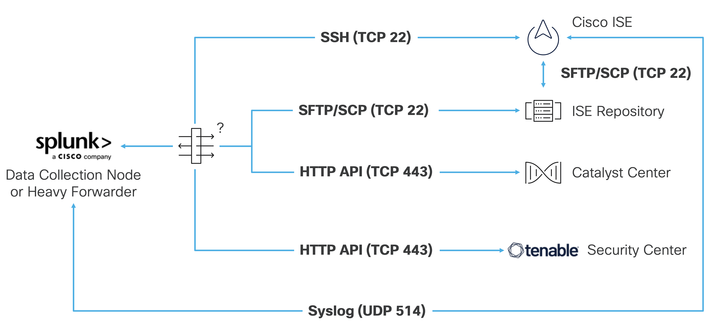

---

# Splunk Cisco Enterprise Networking Application and Technical Add-Ons Installation
### Download App and TAs
Cisco Enterprise Networking for Splunk Platform Application  
[https://splunkbase.splunk.com/app/7539](https://splunkbase.splunk.com/app/7539)  
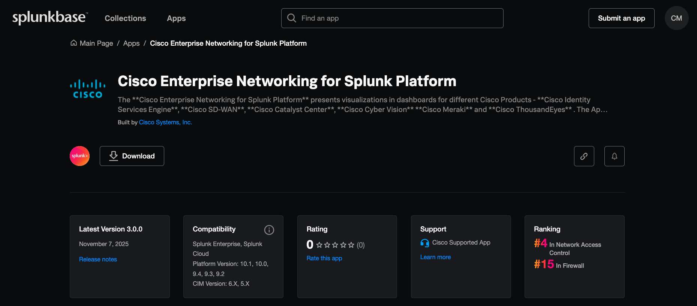

Cisco Catalyst Add-on for Splunk  
[https://splunkbase.splunk.com/app/7538](https://splunkbase.splunk.com/app/7538)  
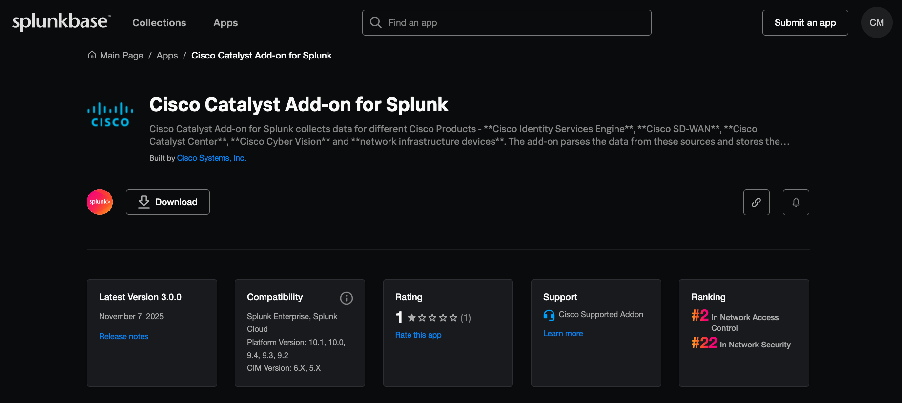

> **Implementation Note:** The Cisco Catalyst Enhanced Netflow Add-on for Splunk prerequisite is NOT required for Comply to Connect (C2C) Reporting

Tenable Add-On for Splunk - Optional  
[https://splunkbase.splunk.com/app/4060](https://splunkbase.splunk.com/app/4060)  
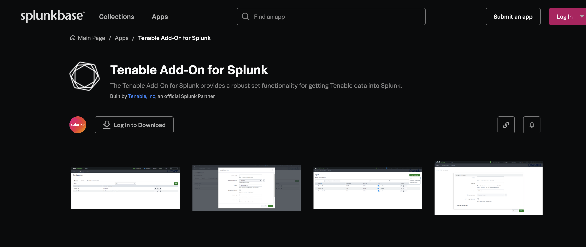

### Install Reporting App and TAs on Splunk Server
Open a web browser and go to http://<IP|Hostname>:8000  
Navigate to Apps > Manage Apps  
Click **"Install App From File"** on the top right, select the downloaded app bundle and click **Upload**  

### Add props.conf for Syslog Truncate
Some ISE Syslog messages are over the Splunk default 10,000 byte length. Therefore the Truncate length must be set to 20,000 to ensure that logs are not truncated before all the data elements are indexed.   
#### Create a local **props.conf** in the **local** directory and add following stanza:  
`vi /opt/splunk/etc/apps/cisco-catalyst-app/local/props.conf`
```
[cisco:ise:syslog]
TRUNCATE = 20000
```

---

# Cisco Identity Services Engine Configuration
### Configure ISE Syslog
On the ISE Admin UI navigate to **Administration > System > Logging > Remote Logging Targets**  
Click **"Add**"  
Configure the Splunk Reporting Destination  
* **Name:** Simple Name in the ISE UI  
* **Target Type:** UDP SysLog / TCP SysLog  
* **Host / IP Address:** \<SplunkReportingToolIP\>  
* **Port:** UDP/TCP Syslog (Ensure that the firewall of the server is open to receive on this port)  
* **Maximum Length:** 8192 (Must be set to this maximum length)  
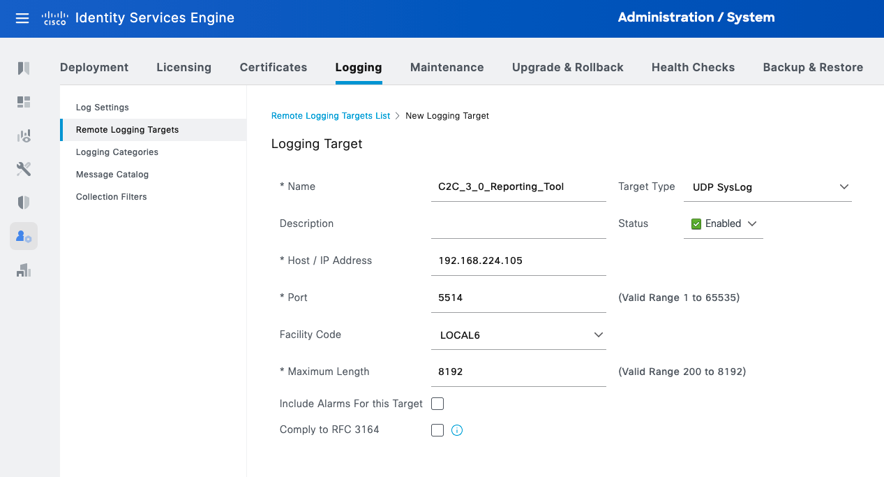  
Click **Submit**  

Navigate to **Logging Categories**  
- The Reporting Tool requires 8 logging categories to gather the data for C2C reporting. The sizing of the environment is based on these categories only. Any additional categories that are sent may increase the ingest sizing and could lead to license violations.

The required logging categories are:
* **AAA Audit**
    * AAA Audit
    * Failed Attempts
    * Passed Authentications
* **Accounting**
    * Accounting
    * RADIUS Accounting
* **Administrative and Operational Audit**
    * Administrative and Operational Audit
* **Posture and Client Provisioning Audit**
    * Posture and Client Provisioning Audit
* **Profiler**
    * Profiler

To add the Logging Target to the Category, click the Category Name, Select the Target from the **"Available"** column and click the **">"** icon to move it to the **"Selected"** column.

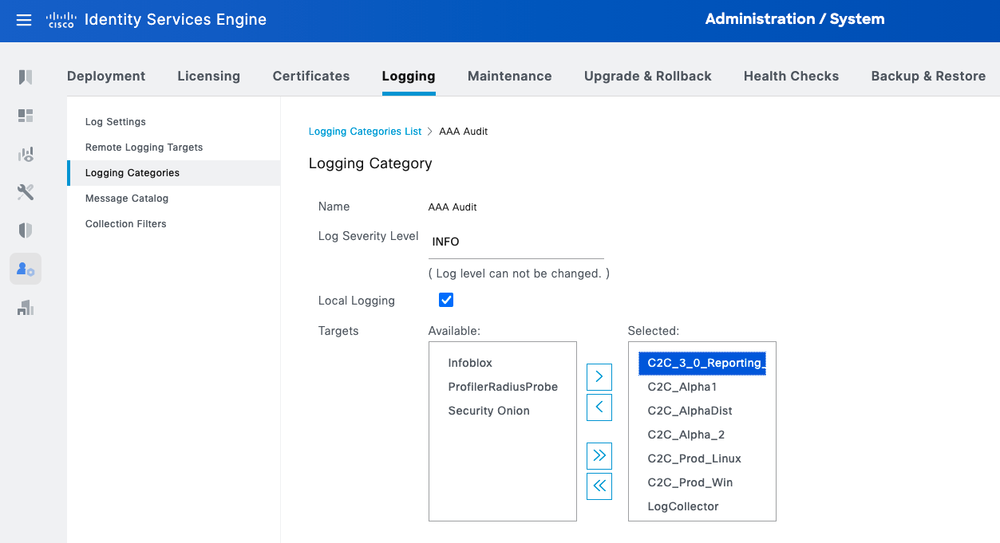

Repeat the above for all of the logging categories. After complete you can filter based on your Target name to confirm.

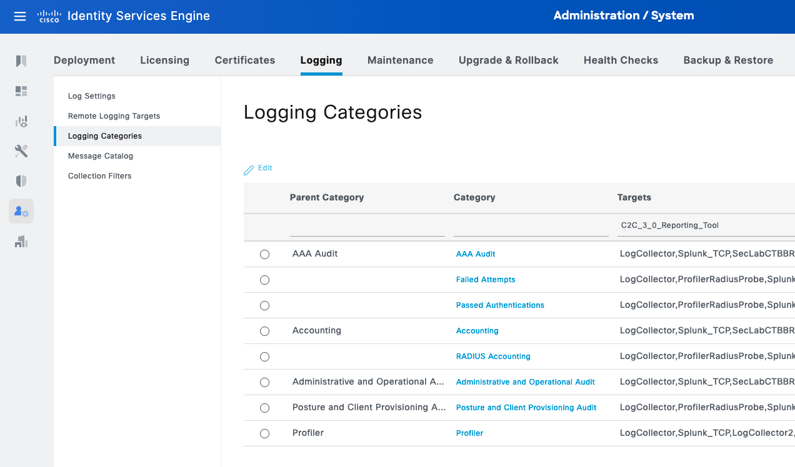

---


### Configure ISE Repositories
For Analytics reports to be successfully gathered from ISE into the reporting tool it will require the names and access to a local disk and remote SFTP repository. To configure these in ISE, navigate to **Administration > System > Maintenance** and select **Repository** in the menu.  

Click **"Add"** to configure the local disk repository if one is not already defined
* **Repository Name:** \<disk-example\>
* **Protocol:** DISK
* **Path:** /

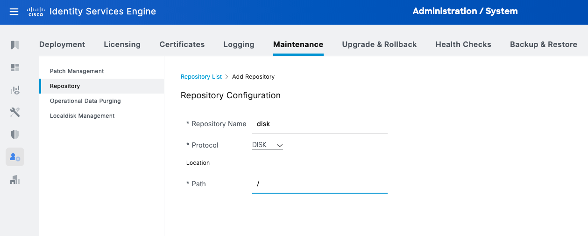

Click **"Add"** to configure an SFTP repository if one is not already defined
* **Repository Name:** \<SFTP-Example\>
* **Protocol:** SFTP
* **Server Name:** \<IP\Hostname\>
* **Path:** \</ReportingApp30\>
* **User Name:** \<username\>
* **Password:** \<password\>

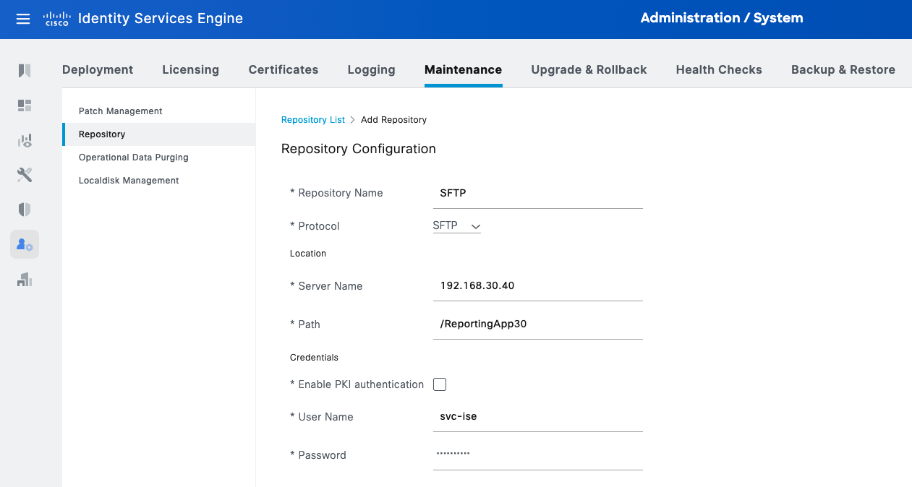

When you click **"Submit"** for the SFTP repo you will be prompted to ensure that the Crypto Host Key must be added using the CLI. This will be covered in the CLI account creation steps below.

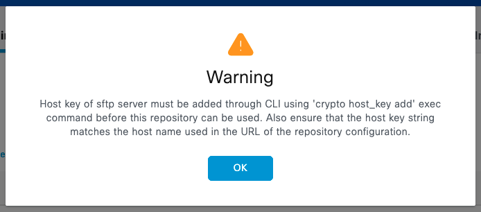

---

### ISE Analytics CLI Account and Host Key Configuration
You will need to create a dedicated CLI account on the ISE PAN node to use with the reporting app for running and moving the reports to the repository for processing.  
Log in to your ISE primary Admin node with your existing credentials  
Execute the following to create the account with your desired username and password.  
```username reporting password plain ************* role admin```  
(Special characters may require double quotes \"). 
Note: The password will be required to be changed on the first login so don't use your final desired password until the change password prompt is presented.

After the user account is created we will need to log in using SSH with that user account to complete the SFTP Host Key configuration.  
As the new admin user execute the following to save and validate the host key addition:  

```crypto host_key add host <IP\Hostname>```  

You should see "host key fingerprint added" or run:

```show crypto host_keys```
OR
```show repository <SFTPrepoName>``` to validate that you can successfully connect to the repository.

---

# Cisco Catalyst Center Configuration - Optional
### Create Catalyst Center Reports
The C2C Reporting App pulls the result of native Catalyst Center reports to present dashboards for network device compliance. The following screenshots show the required reports. The TA will require an API account with permissions to pull the reports and the report names will also be required.  

### Create API User
Navigate to **System > Users & Roles > User Management** and click **"Add"**  
Create the User Account with minimum of OBSERVER-ROLE for API collection of the reports.  
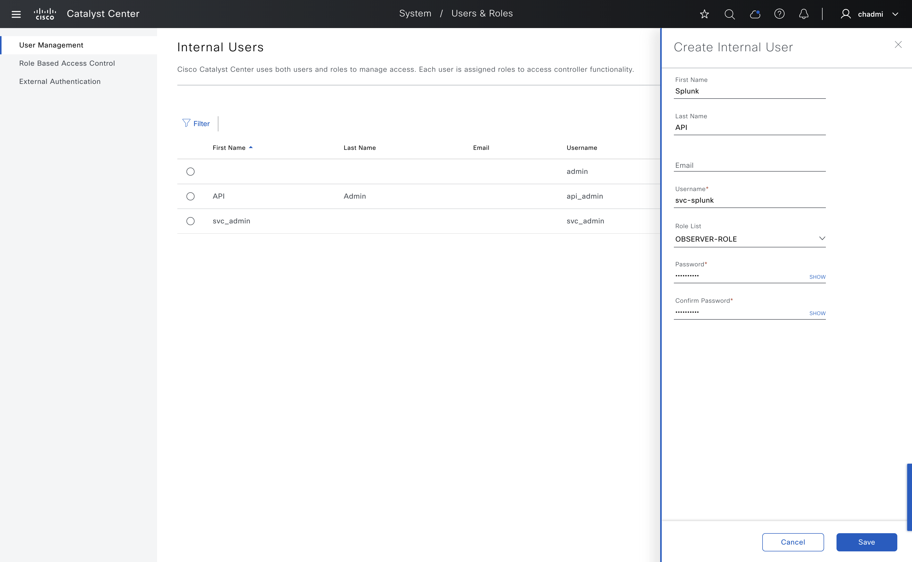
Note: External Authentication is also usable with role assignment.

### Create Scheduled Reports
#### Compliance Report
Navigate to **Reports > Report Templates > Compliance** and click **"Generate"**  
Finish the Report wizard with the following inputs:
* **Report Name:** Simple Name (This will be input into the Add-on)
* **Scope:** (Default is all devices, ingest size can be reduced with optional filter of Compliance Status = Non Compliant)
* **Report Type:** CSV
* **Fields:** (Default is all fields below, \* denotes minimum required fields)
    * Sl.No \*
    * Device Name \*
    * Device Family
    * Device Type
    * IP Address \*
    * Compliance Status \*
    * Software Image \*
    * Startup Vs Running Configuration \*
    * Critical Security Advisories \*
    * Network Profile \*
    * Network Settings \*
    * EoX \*
* **Schedule:** At least once a week  
All other configuration should be left at the default.

#### Inventory Report
Navigate to **Reports > Report Templates > Inventory** and click **"Generate"** for the **"All Data"** report  
Finish the Report wizard with the following inputs:
* **Report Name:** Simple Name (This will be input into the Add-on)
* **Scope:** Global (ingest size can be reduced with optional filter of Location if reporting scope is smaller than Global)
* **Report Type:** CSV
* **Fields:** (Default is all fields below, \* denotes minimum required fields)
    * Device Family
    * Device Type
    * Device Name \*
    * Serial No. \*
    * IP Address \*
    * Status
    * Software Version \*
    * Up Time \*
    * Part No. \*
    * Location \*
    * No. of Users \*
    * No. of ethernet ports
    * Time Since Code Upgrade via Cisco DNA Center SWIM
    * DNA License
    * Network License \*
    * Fabric Role
* **Schedule:** At least once a week  
All other configuration should be left at the default.

Take note of the Report Names as they will be entered into the Add-on later in this guide

---

# Splunk Reporting Application Configuration 
### Create Indexes on Splunk
In Splunk configure indexes for the data collection. Avoid using the **"Main**" index. Individual indexes provide separate retention, access, and meaningful naming in the case that data needs to be purged from the system.  
For the reporting app there will be:
* Syslog data from ISE
* Analytics Report data from ISE
* Network Compliance data from Catalyst Center - Optional
* Hardware and Vulnerability data from Tenable - Optional

In this example separate indexes will be used for each source.  
* ise_syslog
* ise_analytics
* catalyst_center (optional)
* tenable (optional)

To configure the indexes, go to the Splunk Indexer instance and select **Settings > Indexes**  
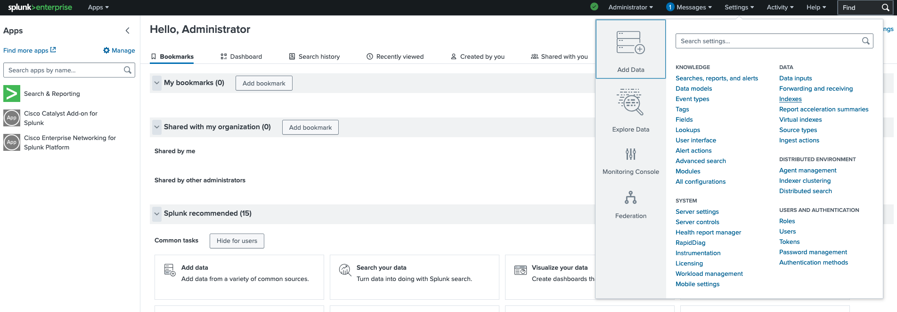  

Click **"New Index**" and give it a name and **"Max size**" values (Size is dependent the environment)  
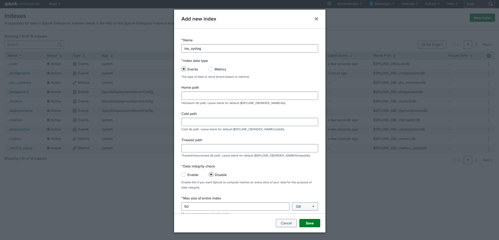  

---

## Create Inputs in the Cisco Catalyst Add-on for Splunk

### Cisco Identity Services Engine 
On the Splunk UI navigate to the **Cisco Catalyst Add-on for Splunk** and click on **"Configure Application"** on the Identity Services Engine (ISE) tile.  
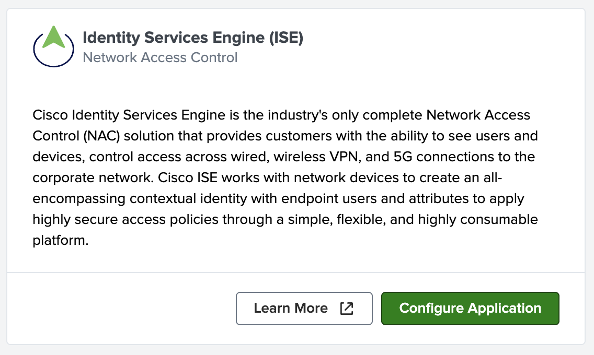

#### Analytics Account Configuration
Once in the ISE Application click on the **"Configuration**" tab and click **"Add"**  
In the pop up, change the **"Account Type"** to Analytics Reports and input the requested parameters.
* **Account Type:** Analytics Reports
* **Account Name:** Simple Name for Account Settings
* **IP Address / Hostname:** \<IPAddress/Hostname\>
* **Username:** \<CLI User Account\> 
* **Password:** \<CLI User Password\>
* **ISE SSH Port:** 22 (default)
* **Repository Address:** \<SFTP Repository Address/Hostname\>
* **Repository User:** \<Repo User Account\>   
* **Repository Password:** \<Repo User Password\> 
* **Repository SCP/SFTP Port:** 22 (default)

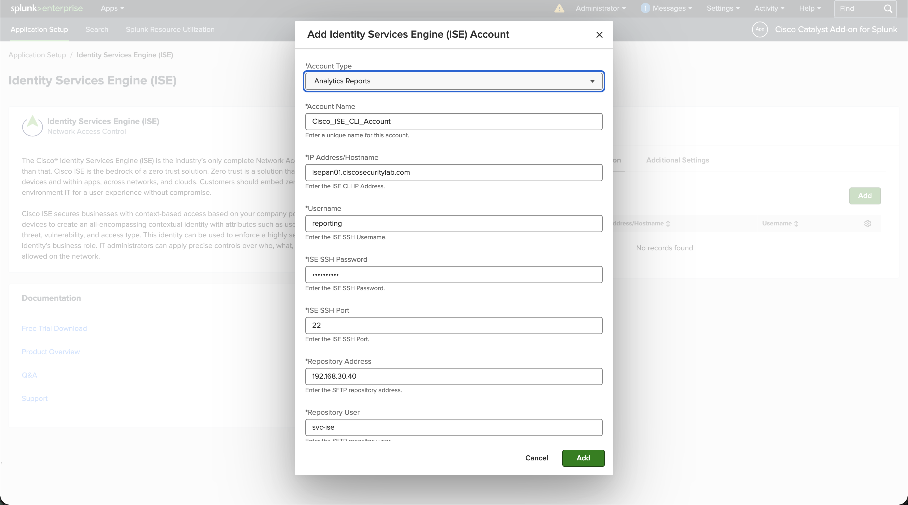

#### Analytics Input Configuration
Navigate to the **"Inputs"** tab and select the **"ISE Analytics Reports"** input from the dropdown and input the requested parameters.  
* **Input Type:** ISE Analytics Reports
* **Name:** Simple Name for Input
* **Interval:** \<Interval in Seconds\> (3600 default, 86400 recommended)
* **Index:** \<Index previously configured\>
* **Cisco ISE Account:** Select the Account Name from the previous step
* **Cisco ISE Disk Repository Name:** \<Local Disk Repo Name\>
* **Cisco ISE SFTP Repository Name:** \<SFTP Repo Name\>
* **Repository Path:** \<Path with trailing slash\>
Note: In most cases the Repository Path will match the path configured in ISE.  

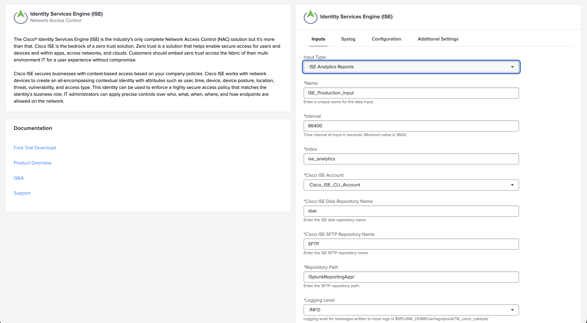

#### Syslog Configuration
Navigate to the **"Syslog"** tab and input the Syslog protocol and port configured on the ISE Syslog Target step and select the Index created for Syslog input.  

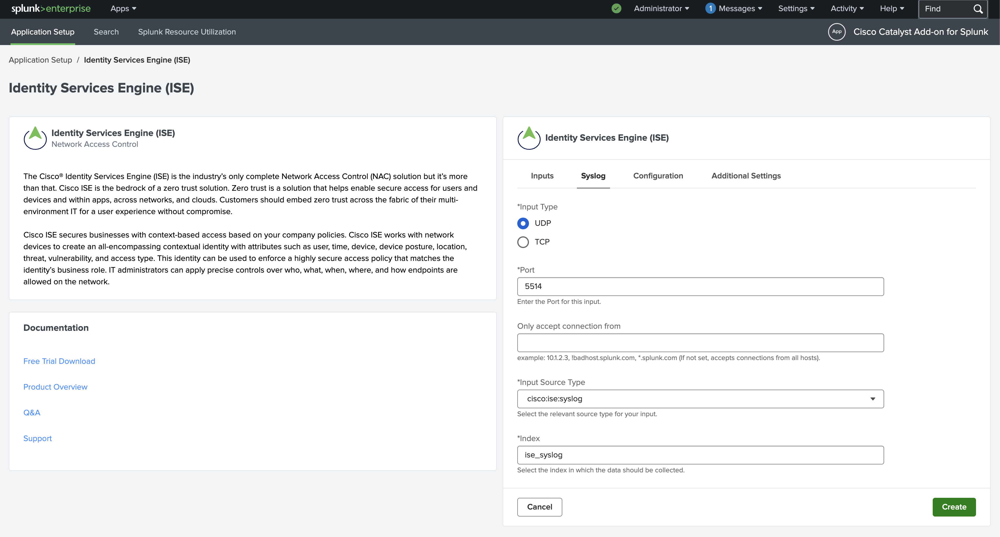

---

### Cisco Catalyst Center
On the Splunk UI navigate to the Cisco Catalyst Add-on for Splunk and click on **"Configure Application"** on the Catalyst Center tile.  

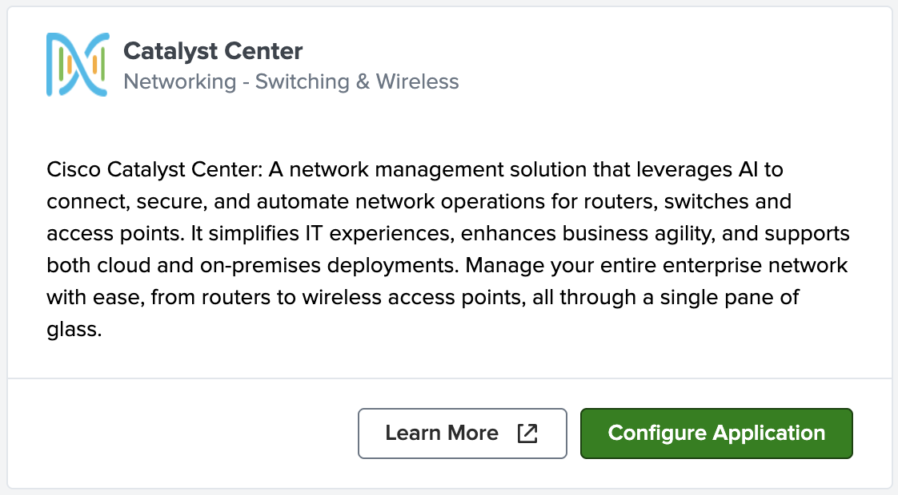

Navigate to the **"Configuration"** tab and click **"Add"**  
In the pop up, input the API credentials for Catalyst Center
* **Account Name:** Simple Name for Account Settings
* **Cisco Catalyst Center Host:** \<IPAddress/Hostname with leading https:\\\\\>
* **Username:** \<API User Account\>   
* **Password:** \<API User Password\>   

  

Navigate to the **"Inputs"** tab and select the **"Input Type"** dropdown and select **"Reports"**  and input the requested parameters.  
* **Input Type:** Reports
* **Name:** Simple Name for Input
* **Interval:** \<Interval in Seconds\> (14400 default, Match Interval of Reports when built, typically once daily or 86400)
* **Index:** \<Index previously configured\>
* **Cisco Catalyst Center Account:** Select the \<Account Name\> from the [**Configuration Tab**](#cisco-catalyst-center) step 
* **Device Inventory Report Name:** \<Inventory Report Name\> from [**Create Catalyst Center Reports**](#create-catalyst-center-reports) step
* **Device Compliance Report Name:** \<Compliance Report Name\> from [**Create Catalyst Center Reports**](#create-catalyst-center-reports) step

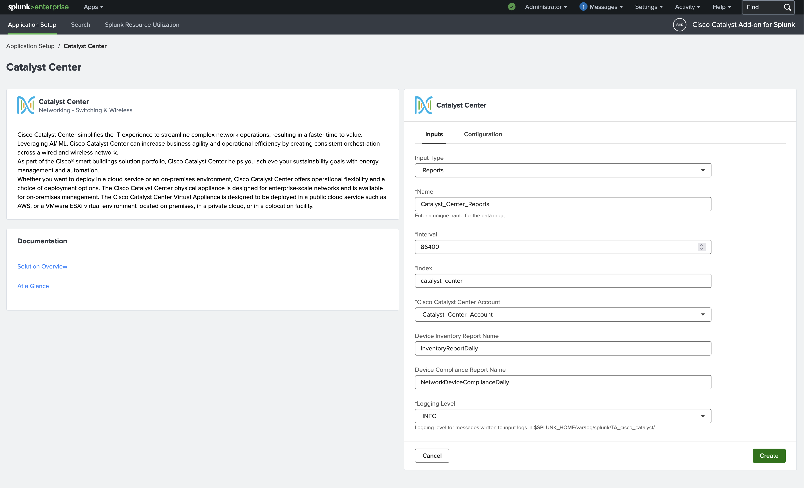  

---

### Tenable Add-On
On the Splunk UI navigate to the Tenable Add-on for Splunk.
Configure the Add-On for Tenable Security Center using the public Tenable Documentation.  
[https://docs.tenable.com/integrations/Splunk/Content/Splunk2/Installation.htm](https://docs.tenable.com/integrations/Splunk/Content/Splunk2/Installation.htm)

---

# Search Macros

### Understanding Splunk Search Macros

#### What is a Search Macro?
A search macro is a reusable building block of **Search Processing Language (SPL)**. Think of it as a "shortcut" or a "variable" that stores a complex string of code, a specific filter, or a set of instructions. Instead of typing the same code into dozens of different saved searches, you define it once in a macro and reference it elsewhere.

In Splunk, macros are always referenced by surrounding the macro name with **backticks**, like this: 
`` `cisco_catalyst_app_index` ``

#### How Macros are Used in Splunk

1.  **Centralized Management (The "Change Once, Update Everywhere" Principle)**
    The primary benefit of macros is maintenance. For example, if a Cisco ISE logs are moved from an index named `old_index` to `new_index`, you don't have to manually edit 50 different saved searches. You simply update the `cisco_catalyst_app_index` macro once, and every search using that macro is instantly updated.

2.  **Simplifying Complex Logic**
    Macros can hide "ugly" or complex code—such as long Regular Expressions (regex) used for parsing security posture—making the actual saved searches much easier to read and audit. 
    *   *Example:* Instead of seeing a 100-character regex string in a search, a user sees `` `cisco_catalyst_posture_regex_malware` ``.

3.  **Ensuring Consistency**
    Macros ensure that every dashboard and report in an app is looking at the exact same data. By using a macro like `cisco_catalyst_app_sourcetypes`, you guarantee that the "Total Endpoint Count" dashboard and the "Compliance Report" are both querying the same set of devices.

4.  **Environment Customization**
    Macros allow a single Splunk App to be "portable." When the Cisco Catalyst App is installed in a new environment, the administrator uses the `macros.conf` file to "tune" the app to the specific network without breaking the underlying search logic.

#### Macro Anatomy in the Cisco Catalyst App
In the Cisco Catalyst App, the macros generally fall into three functional types:
*   **Definitions**: Defining where data lives (Indexes and Sourcetypes).
*   **Filters**: Defining specific Plugin IDs (Tenable) or Category names (CYBERCOM).
*   **Parsers**: Defining the Regex patterns used to extract pass/fail results from raw text logs.

---

### Data Scoping Macros

*   **`cisco_catalyst_app_index`**
    *   **Purpose**: Defines the Splunk index(es) where all relevant data (ISE, SD-WAN, Tenable, etc.) is stored.
    *   **Used In**: Generally used in all searches or dashboards to narrow down the dataset to relevant data indexes.
    *   **How to Modify**: By default, it searches all indexes (`*`). **For better performance and security, change this to specific indexes.**
        *   *Example*: Definition = index IN ("ise_syslog","ise_analytics","catalyst_center","tenable")
    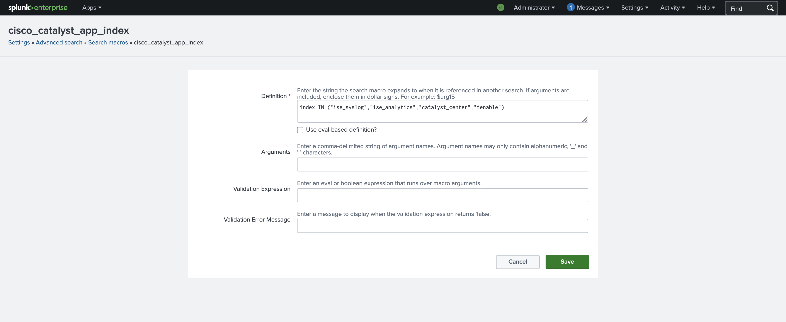  
*   **`cisco_catalyst_app_sourcetypes` Optional**
    *   **Purpose**: Filters searches to only include specific sourcetypes related to the Cisco ecosystem and Tenable.
    *   **Used In**: Generally used in all searches or dashboards to narrow down the dataset to relevant sourcetypes.
    *   **How to Modify**: If using a custom sourcetype for data inputs (e.g., `cisco:ise:custom`), add it to the list.
        *   *Example*: Definition = sourcetype IN ("cisco:ise*", "cisco:sdwan*", "cisco:dnac*", "stream:netflow", "cisco:cybervision:*","meraki:*", "cisco:ios", "cisco:thousandeyes:test", "cisco:sgacl:logs","cisco:catalyst:center:*", "cisco:ise:analytics*", "tenable:sc*")
    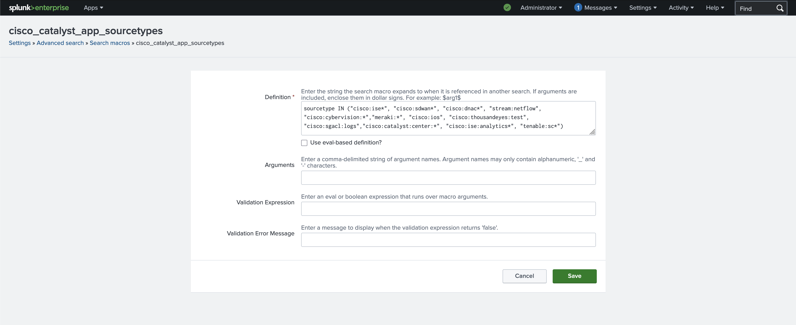  
*   **`summariesonly` Optional**
    *   **Purpose**: Controls whether searches pull data from Data Model acceleration summaries or raw data.
    *   **Used In**: Almost every search starting with `| tstats`.
    *   **How to Modify**: Set to `true` to significantly speed up dashboards if Data Model acceleration is turned on.
        *   *Example*: `Definition = summariesonly=true`
    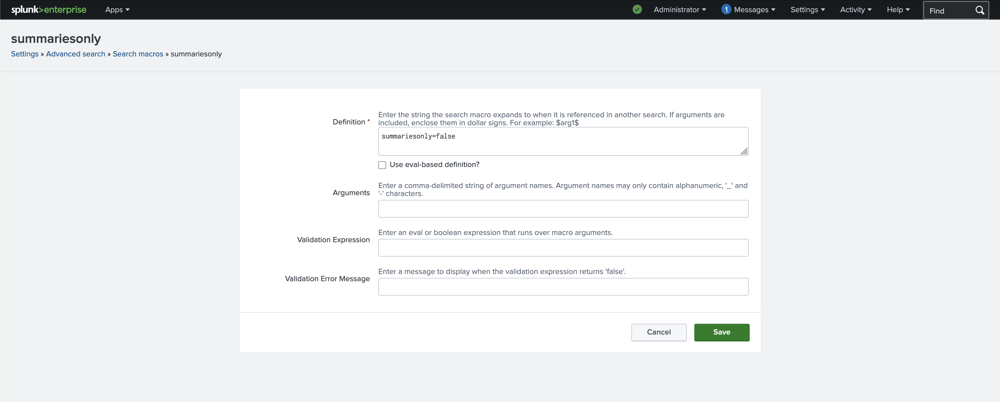

---

### Posture & Compliance Regex Macros
These macros use Regular Expressions to parse the results of security checks from raw ISE syslog messages in MESSAGE_CODE 87000 & 87001.

*   **Macros**: 
    * `cisco_catalyst_posture_regex_encrypt`
    * `cisco_catalyst_posture_regex_firewall`
    * `cisco_catalyst_posture_regex_malware`
    * `cisco_catalyst_posture_regex_patch`
    * `cisco_catalyst_posture_regex_USB`
*   **Used In**: `cisco_catalyst_ise_posture_report_v2`.
*   **How to Modify**: These depend on the naming convention of the Posture Policies in Cisco ISE and assume that multiple `PostureReport` values come in from Syslog, 1 for each Macro. If the policies are named `CORP_Antivirus` instead of `C2C_AntiMalware`, the regex must be updated. It is recommended to Not change the extracted variable name enclosed in the `(?<>)`
    *   *Example*: `definition = "CORP_Antivirus_\w+_Policy\\\;(?<C2CMalwareResult>[\w]*)"`
    *   In the case that your checks/conditions are nested inside of a single `PostureReport` key like the below the Regex may look more like `C2CR-WIN-AM:\w+:(?<C2CMalwareResult>w+)`

---

### Categorization Macros

#### cisco_catalyst_CYBERCOM_Macro
*   **Purpose**: Defines the list of official device categories.
*   **Used In**: 
    * `cisco_catalyst_profiler_summary_v4`
    * `ImplementationStep1Metric2`
    * `cisco_catalyst_010_reporting_uscybercom_device_category_step_1`.
*   **How to Modify**: Add or remove categories to match the organization's specific device classification standards. Ensure that no spaces are on the leading or trailing of each Logical Profile in the definition.
    *   *Example*: Definition = "(Workstations|Servers|Printers|Medical Devices)"
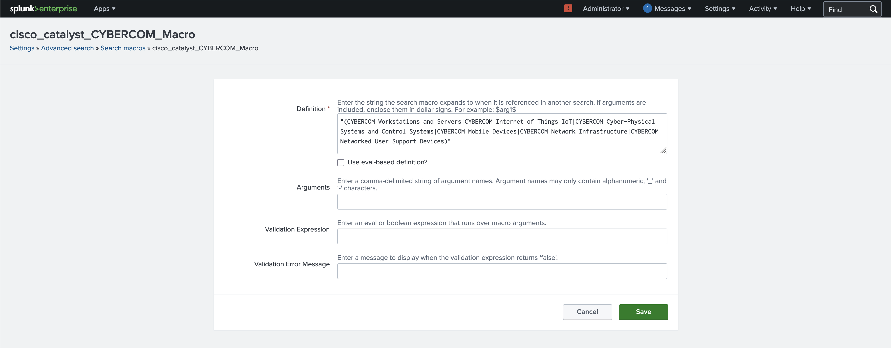

#### cisco_catalyst_CYBERCOM_Unknown
*   **Purpose**: The fallback label for devices that haven't been profiled.
*   **Used In**: 
    * `cisco_catalyst_profiler_summary_v4`
    * `ImplementationStep1Metric2`.
*   **How to Modify**: Change the string if a different label like "Unclassified" or "Pending".

---

### Reporting & Metadata Macros
These macros provide the "Header" information for compliance reports.

*   **Macros**: 
    * `cisco_catalyst_reporting_owner`
    * `cisco_catalyst_reporting_AO`
    * `cisco_catalyst_reporting_deployment_id`.
*   **Used In**: `cisco_catalyst_report_all_step_2`.
*   **How to Modify**: These **must** be changed for every installation.
    *   *Example*: Change `Example Owner` to `Department of Transportation`.
    *   *Example*: Change `B9EJMA12345` to the actual site deployment ID (Commonly Primary Admin Node ISE Serial Number).

---

### Access Level Mapping Macros

#### cisco_catalyst_access_level_full
*   **Purpose**: Defines the string used in ISE Authorization Policies to indicate a device has full network access.
*   **Used In**: `cisco_catalyst_step_4_authentication_details`.
*   **How to Modify**: Change this to match the specific "Result" name in ISE.
    *   *Example1*: Definition = "PermitAccess"
    *   *Example2*: If multiple Authorzation Policies indicate full network access, Definition = "(PermitAccess|Compliant|*etc*)"

#### cisco_catalyst_access_level_remediation
*   **Purpose**: Defines the string used in ISE Authorization Policies to indicate a device has limited network access
*   **Used In**: `cisco_catalyst_step_4_authentication_details`.
*   **How to Modify**: Change this to match the ISE Authorization Profile name for restricted access.
    *   *Example1*: Definition = "Quarantine"
    *   *Example2*: If multiple Authorzation Policies indicate limited network access, Definition = "(Quarantine|Remediation|Limited|*etc*)"

---

### Tenable Plugin Macros
These macros define the specific Tenable Plugin IDs used to extract hardware and software details.

*   **Macros**: 
    * `cisco_catalyst_windows_installed_plugin`
    * `cisco_catalyst_windows_disk_info_plugin`
    * `cisco_catalyst_windows_comp_prod_info_plugin`
    * `cisco_catalyst_windows_network_int_plugin`
    * `cisco_catalyst_windows_memory_info_plugin`
    * `cisco_catalyst_windows_processor_info_plugin`
    * `cisco_catalyst_windows_TPM_info_plugin`
    * and the corresponding `other` (Linux/Unix) versions.
*   **Used In**: All Tenable-specific searches (e.g., `cisco_catalyst_windows_os_details_v2`, `cisco_catalyst_other_hardware_details_v2`).
*   **How to Modify**: These values **must** be updated in every environment as the custom plugins get assigned a unique number upon import to the Tenable Security Center.
    *   *Example*: `definition = Cisco_Catalyst_Dataset.Cisco_Catalyst_Tenable.tenable_plugin_id="999999"`

---

# Cisco ISE Network Device Groups Lattitude and Longitude Mapping
If you are planning to use the GeoStats Maps view on the Dashboard Overview tab the Splunk Lookup Table will need to be updated with your ISE Network Device Group names and a latitude and longitude value for accurate placement.  
To properly place the counts on the geo-stats map you will need the **Network Device Group**
The following is an example of how to edit the lookup file located at:   
    `/opt/splunk/etc/apps/cisco-catalyst-app/lookups/cisco_catalyst_ise_location_mapping.csv`  
    
    Location,lat,lon
    Location#All Locations#HerndonLab#Lincoln County NV,37.2343,-115.8066
    Location#All Locations#HerndonLab#Ashburn,39.0438,-77.4874
    Location#All Locations#HerndonLab#Denver,39.7392,-104.9903
    Location#All Locations#HerndonLab#Honolulu,21.3099,-157.8581
    Location#All Locations#HerndonLab#Tempe,33.4255,-111.9400
    Location#All Locations#HerndonLab#Washington DC,38.9072,-77.0369
    Location#All Locations#Home Office,51.5072,-0.1180
If you don’t wish to plot individual Device Groups you can use the Wildcard option detailed below. Update the Lookup Table to reflect the single LAT/LON that you want all devices associated with:  
    `/opt/splunk/etc/apps/cisco-catalyst-app/lookups/cisco_catalyst_ise_location_mapping.csv`  

    Location,lat,lon  
    Location#All Locations*,37.2343,-115.8066  

---

# Cisco Enterprise Networking for Splunk Platform App
The Cisco Enterprise Networking for Splunk Platform App has been updated to include additional dashboards and views for endpoint compliance and reporting. Many of these views have been tailored to specific requirements of the DoW Comply to Connect (C2C) program while also having many uses in other customer segments as well. All of the data inputs configured above are required for the **Analytics Reports** and **Detailed Reports** navigations within the app.  

---

## Analytics Reports Menu
### Overview Reports
This view provides high level information on Activity Location, Device Classification, Authentication, Device Compliance, and Infrastructure.   
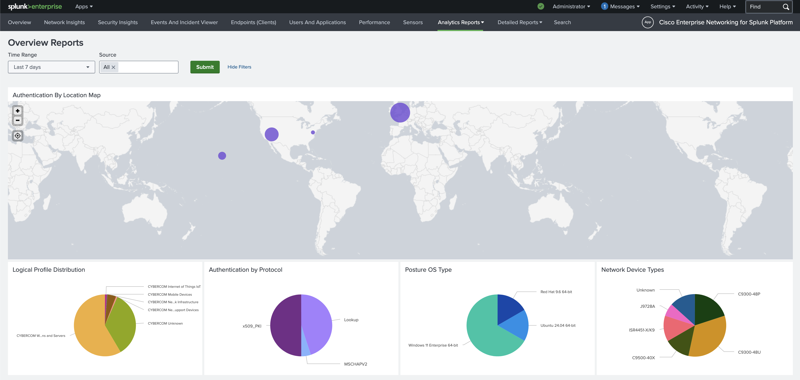

### Endpoint Compliance
This view provides total count of Compliant/NonCompliant devices and the specific requirements that are failing from Cisco ISE Syslog and Analytics Report Inputs. Additionally, it provides a trend of compliance over time and details of compliance for every device found on the network. All failing devices are brought to the top of the list for easy identification while the list is also searchable using device MAC address.  
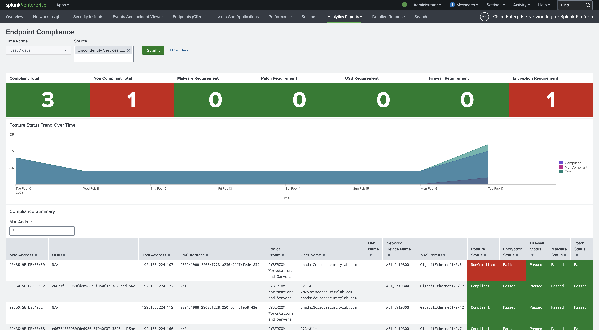

### Network Compliance
This view provides Network Device Inventory and Compliance with specifics from Cisco Catalyst Center Reports Inputs. All devices Cisco & Third party that are managed or monitored with Cisco Catalyst Center will be shown here.  
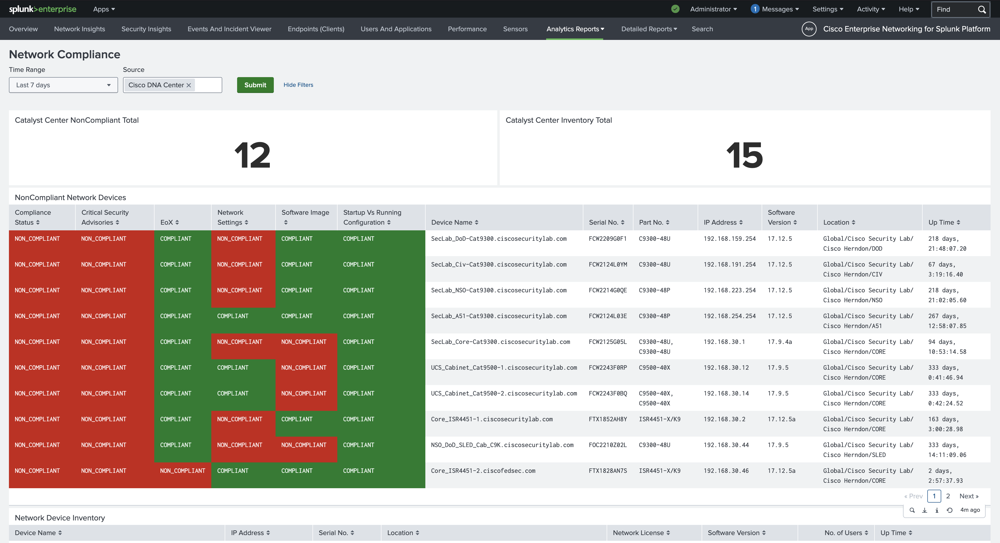

### Master Endpoint Record
This view is the output of the [master report](#master-aggregator-report) that runs on an interval to gather & correlate all the data elements required for reporting. This report will show every endpoint and all of the data elements that have been gathered for each.  
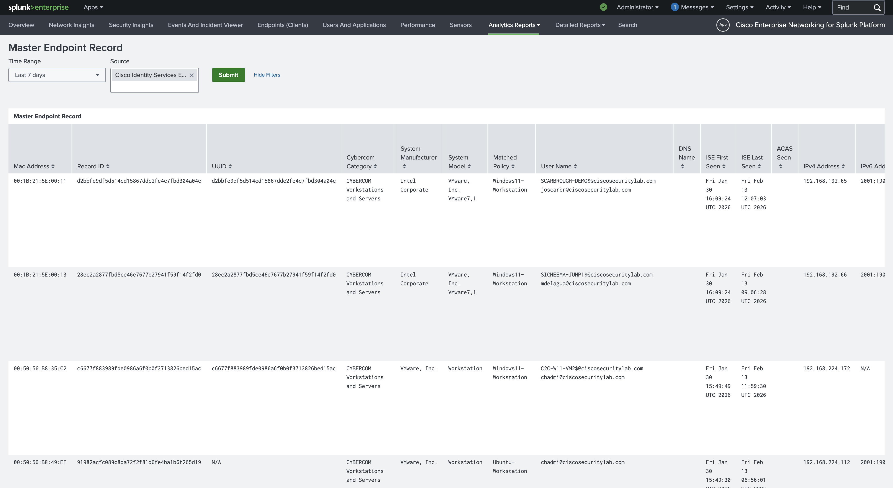

## Detailed Reports Menu
### Step 1 - Device Classification
This report provides views of the C2C 0.1.0 (Device Categorization) & 0.1.1(Operating System Summary) requirements.  
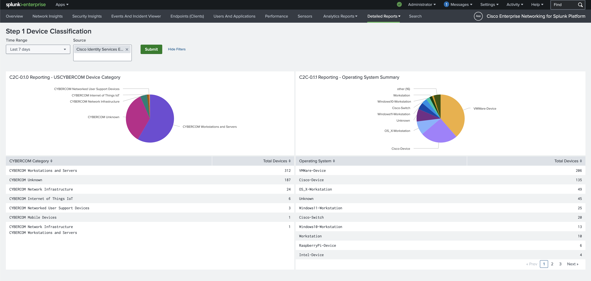

### Step 2 - Manageability and Compliance
This report provides views of the C2C 0.2.0-0.2.24 requirements. This includes Discovery, Manageability, MAB vs 802.1X, Compliance, and other elements.  
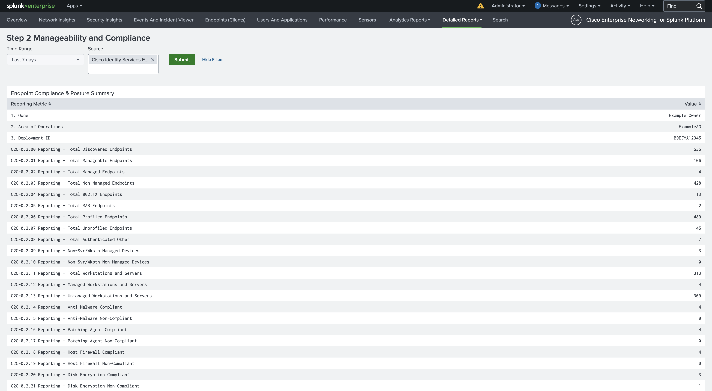

### Step 3 - Compliance Remediation
This report provides results of remediation attempts on all endpoints that required any attempt at remediation.  
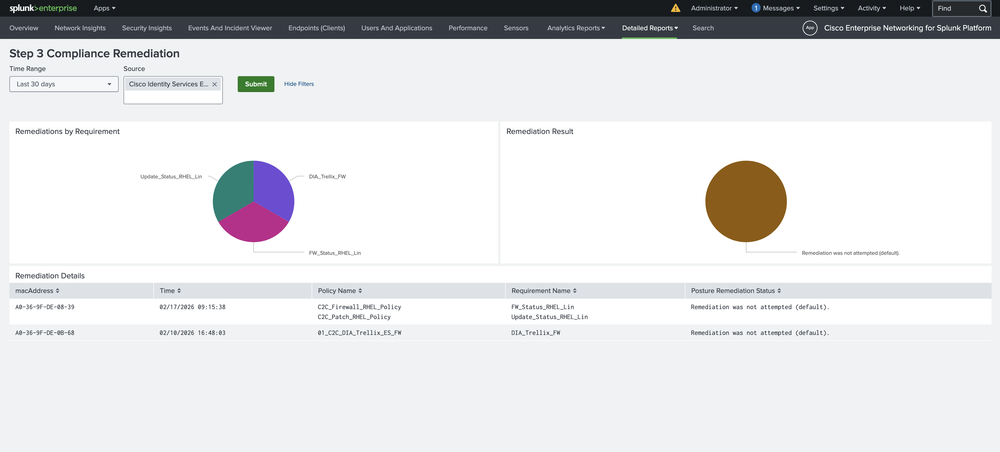

### Step 4 - ICAM Summary
This report provides Identity and Credential Access Management (ICAM) data for every endpoint that uses/used credentials to access the network. It presents the access results, number of attempts over time and identity details where available.  
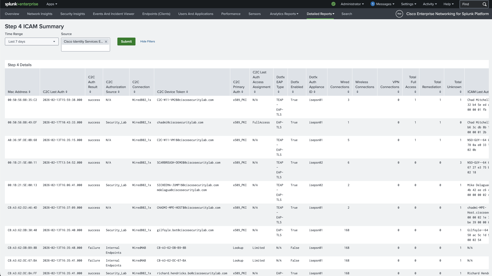

### Implementation Metrics
This view provides KPI metrics based on the C2C program office Goals and Calculations.  
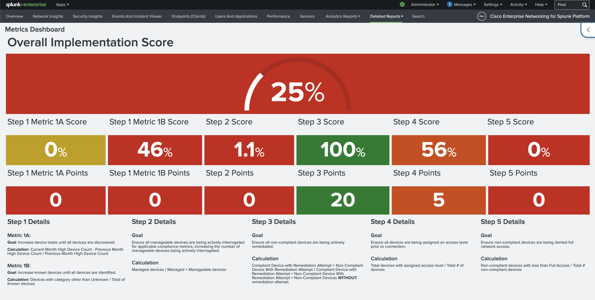

---

# Required for endpoints over 10,000 Endpoints
In the event that the evironment for Analytics reporting exceeds 10,000 endpoints this will encounter a default limit on Splunk which limits Search results to 10,000 records.  

### Modify cisco_catalyst_reports_lookup Using "sort 0"
Adding a "sort 0" to the time sorting on the Master Search named `cisco_catalyst_reports_lookup` can override the default limits.  
* Navigate to *Settings > Searches, reports, and alerts*  
* Select App: *Cisco Enterprise Networking for Splunk Platform(cisco-catalyst-app)*
* Select Owner: *All*
* Filter for, or locate the *cisco_catalyst_reports_lookup* report
* Click *Edit* and *Edit Search*
* Scroll to bottom of search and add a **0 (Zero Digit)** between the *sort* and *_time* command like the example below
```
…  
| sort 0 _time  
| outputlookup cisco_catalyst_analytics_reports.csv create_empty=f  
```

### Editing App Specific limits.conf for subsearches
To increase the Splunk subsearch row limit over the default of 50,000, create/update the settings in an application specific limits.conf. Create or edit limits.conf in `$SPLUNK_HOME/etc/apps/cisco-catalyst-app/local/` and set the stanzas using the following examples (time, mb, and rows should match or slightly exceed your device count).  
 
 Example with defaults:
```
[join]
subsearch_maxtime = 60
subsearch_maxout = 50000

[stats]
maxresultrows = 50000

[mvexpand]
max_mem_usage_mb = 500
```

Example for 200,000 endpoint environment:  
```
[join]
subsearch_maxtime = 300
subsearch_maxout = 201000

[stats]
maxresultrows = 201000

[mvexpand]
max_mem_usage_mb = 1000
```
Restart Splunk after making this change. 

---

# Change Navigation to only show Comply to Connect (C2C) Views - Optional  

### Create the local UI Navigation folder structure.
`mkdir -p /opt/splunk/etc/apps/cisco-catalyst-app/local/data/ui/nav/`  

### Copy the current default.xml from default to local
`cp /opt/splunk/etc/apps/cisco-catalyst-app/default/data/ui/nav/default.xml /opt/splunk/etc/apps/cisco-catalyst-app/local/data/ui/nav/default.xml`  

### Edit the local copy of the default.xml
`vi /opt/splunk/etc/apps/cisco-catalyst-app/local/data/ui/nav/default.xml`  

```
<nav search_view="search">
  <collection label="Analytics Reports">
  <view name="overview_analytics_reports" default='true' />
  <view name="endpoint_compliance_analytics_reports" />
  <view name="network_compliance_analytics_reports" />
  <view name="master_endpoint_record_analytics_reports" />
  </collection>
  <collection label="Detailed Reports">
  <view name="step_1_report" label="Step 1 Device Classification"/>
  <view name="step_2_report" label="Step 2 Manageability and Compliance"/>
  <view name="step_3_report" label="Step 3 Compliance Remediation"/>
  <view name="step_4_report" label="Step 4 ICAM Summary"/>
  <view name="metrics_dashboard" label="Implementation Metrics"/>
  </collection>
  <view name="search"/>
</nav>
```
*Note: If you wish for the default page to be other than the Overview, move the **default='true'** to the view that you want to be the default.*

### Reload the Splunk Web UI
Using your web browser input **http/s://<IPAddress/Hostname>:8000/debug/refresh** and then click the **Refresh** button.  
Once the process completes reload browser where the App is loaded and the nav structure should have changed.

---

# APPENDIX
## Reports / Saved Searches
### Lookup Builders & Discovery

*   **`cisco_catalyst_all_macAddresses`**
    *   **Description**: The "Master Discovery" search that identifies every unique device.
    *   **Key Commands**: 
        * `eval/coalesce` (merges MACs from ISE Analytics Reports, Tenable, and Syslog)
        * `replace/upper` (standardizes MAC format to `XX:XX:XX...`)
    *   **Tuning**: If you add a new data source (e.g., a third-party CMDB), you must add an `append` block here to ensure those devices are included in the master inventory.

---

### ISE Analytics and Syslog Reports

*   **`cisco_catalyst_ise_passed_authn_v3`**
    *   **Description**: Captures successful authentication events.
    *   **Key Commands**: 
            * `rex` (extracts MACs from `cisco_av_pair`)
            * `coalesce` (prioritizes endpoint MAC over VPN MAC)
    *   **Tuning**: If you use a custom RADIUS attribute for MAC addresses, update the `rex` field to point to that attribute.
*   **`cisco_catalyst_ise_hardware_report_v1`**
    *   **Description**: Pulls physical hardware specs from ISE reports.
    *   **Key Commands**: 
            * `eval` (e.g., `memorysize*1024` to normalize units)
            * `round` (formats disk space strings)
*   **`cisco_catalyst_profiler_summary_v4`**
    *   **Description**: Categorizes devices into CYBERCOM buckets based on ISE profiles.
    *   **Key Commands**: 
            * `makemv` (handles multi-value profiles)
            * `mvfilter` (filters using macro to show only relevant logical profiles)
    *   **Tuning**: If devices are showing as "Unknown," verify that the ISE Logical Profile names are included in the `cisco_catalyst_CYBERCOM_Macro`.
*   **`cisco_catalyst_ise_accounting_v2`**
    *   **Description**: Maps MAC addresses to current IP addresses.
    *   **Key Commands**: 
            * `replace` (normalizes MAC format)
*   **`cisco_catalyst_ise_posture_report_v2`**
    *   **Description**: Parses raw posture messages for security compliance.
    *   **Key Commands**: 
            * `rex` (uses 5 posture macros to extract results)
    *   **Tuning**: If posture results are missing, check if your ISE syslog message codes match `87000` or `87001`.
*   **`cisco_catalyst_coams_by_device`**
    *   **Description**: Extracts DoD-specific organizational tags.
    *   **Key Commands**: 
            * `rex` (extracts numeric IDs from display names)
            * `ltrim` (removes leading zeros)

---

### Tenable Asset Intelligence (Windows & Other)

These searches (14 total) use `tstats` to query the Tenable datamodel and `rex` to parse the `plugin_text` field.

*   **Windows Searches**: 
    * **`cisco_catalyst_windows_os_details_v2`**: Extracts Windows OS name, version, vendor, and architecture from Tenable plugin text.
    * **`cisco_catalyst_windows_disk_details_v2`**: Extracts total and free disk space for Windows endpoints.
    * **`cisco_catalyst_windows_hardware_details_v2`**: Extracts BIOS GUID, Vendor, Product, and Serial Number for Windows machines.
    * **`cisco_catalyst_windows_interface_details_v2`**: Extracts NIC (Network Card) manufacturer and product names.
    * **`cisco_catalyst_windows_memory_details_v2`**: Extracts total physical memory (RAM) and converts it to MB.
    * **`cisco_catalyst_windows_processors_details_v2`**: Extracts CPU version, count, and core counts.
    * **`cisco_catalyst_tpm_details_v2`**: Specifically parses Tenable data for TPM (Trusted Platform Module) versions and manufacturers.

*   **Other (Linux/Network) Searches**: 
    * **`cisco_catalyst_other_os_details_v2`**: Extracts OS vendor, version, and platform names for Linux/Unix/Other systems.
    * **`cisco_catalyst_other_arch_details_v2`**: Extracts kernel version and hardware architecture for non-Windows systems.
    * **`cisco_catalyst_other_disk_details_v2`**: Parses filesystem tables to find total and free disk space on non-Windows systems.
    * **`cisco_catalyst_other_hardware_details_v2`**: Extracts BIOS/System info (Vendor, Product, Serial, UUID) for non-Windows systems.
    * **`cisco_catalyst_other_interface_details_v2`**: Extracts NIC vendor and product info for non-Windows systems.
    * **`cisco_catalyst_other_memory_details_v2`**: Extracts total physical memory for non-Windows systems.
    * **`cisco_catalyst_other_processor_details_v2`**: Extracts CPU version and core counts for non-Windows systems.
*   **Key Commands**:
    *   `rex field=pluginText`: Used to extract specific strings (e.g., "Architecture:", "Kernel:", "UUID:").
    *   `eval`: Used to normalize units (e.g., converting bytes to GB).
*   **Tuning**: If Tenable updates their plugin output format, the `rex` patterns in these searches must be updated to match the new text structure.

---

### Step Reporting

#### Step 1: Visibility
* **`cisco_catalyst_010_reporting_uscybercom_device_category_step_1`**: Counts devices grouped by their CYBERCOM Category (e.g., IoT, Network Infrastructure).
* **`cisco_catalyst_011_reporting_operating_system_summary_step_1`**: Counts devices grouped by their Operating System (Matched Policy).

#### Step 2: Management
* **`cisco_catalyst_0200_reporting_total_discovered_endpoints_step_2`**: Calculates the distinct count of all MAC addresses found in Tenable or ISE.
* **`cisco_catalyst_0201_reporting_total_manageable_endpoints_step_2`**: Counts endpoints identified as "Workstations" (manageable devices).
* **`cisco_catalyst_0202_reporting_total_managed_endpoints_step_2`**: Counts endpoints that have successfully sent a posture report (Code 87000).
* **`cisco_catalyst_0203_reporting_total_non_managed_endpoints_step_2`**: Counts endpoints that are NOT workstations (non-manageable).
* **`cisco_catalyst_0204_reporting_total_8021X_endpoints_step_2`**: Counts endpoints using 802.1X authentication.
* **`cisco_catalyst_0205_reporting_total_mab_endpoints_step_2`**: Counts endpoints using MAB (MAC Authentication Bypass).
* **`cisco_catalyst_0208_reporting_total_authenticated_other_step_2`**: Counts endpoints using other authentication methods (Code 5236).
* **`cisco_catalyst_0209_reporting_non_svr_wkstn_managed_devices_step_2`**: Counts managed IoT/Infrastructure devices.
* **`cisco_catalyst_0210_reporting_non_svr_wkstn_non_managed_devices_step_2`**: Counts non-managed mobile devices.
* **`cisco_catalyst_0211_13_reporting_svr_wkstn_managed_and_non_managed_devices_step_2`**: Calculates the gap between total workstations and those actually managed.
* **`cisco_catalyst_0206_7_14_24_reporting_step_2`**: A multi-metric search calculating counts for Profiled/Unprofiled devices, specific security check passes (Malware, Patch, etc.), and Serial Number collection.
* **`cisco_catalyst_report_all_step_2`**: Aggregates all Step 2 metrics into a single transposed table for a dashboard view.

#### Step 3: Remediation
* **`cisco_catalyst_step_3_remediation_attempt_records`**: Tracks remediation events (Code 62004). It shows which policy/requirement was attempted and whether the remediation was successful or failed.

#### Step 4: Access Control
* **`cisco_catalyst_step_4_connections`**: Charts connection types (Wired, Wireless, VPN) over the last 30 days.
* **`cisco_catalyst_step_4_access_levels`**: Categorizes devices based on the ISE Authorization Policy matched (Full Access, Remediation, or Unknown).
* **`cisco_catalyst_step_4_icam_attributes`**: Extracts ICAM data, specifically identifying User vs. Device certificates and their respective Issuers (CAs).
* **`cisco_catalyst_step_4_authentication_details`**: Detailed breakdown of EAP types, 802.1X status, and the specific ISE server that handled the last authentication.
* **`cisco_catalyst_step_4_report_all`**: Joins all Step 4 sub-searches into a single master report for access control auditing.

---

### Master Endpoint Record Aggregator & Implementation Scoring

#### Master Aggregator Report
*   **`cisco_catalyst_reports_lookup`**
    *   **Description**: The most critical search. It joins **20+ other searches** together using `macAddress`. It uses `coalesce` to prioritize the best available data from ISE or Tenable and saves the final result to `cisco_catalyst_analytics_reports.csv`.
    *   **Key Commands**: 
        * `join type=left macAddress` (performed 20+ times)
        * `coalesce` (prioritizes best data source), `outputlookup`.
    *   **Tuning**: This search is resource-intensive. Ensure it is scheduled to run when system load is low.

#### Implementation Metrics
*   **`cisco_catatlyst_implementation_step[1-5]_metric[1-2]`**
    *   **Description**: Calculates percentage-based scores for each implementation phase.
        *  **(6 searches total)**
            * **`cisco_catatlyst_implementation_step1_metric1`**: Measures the growth/change in discovered devices month-over-month.
            * **`cisco_catatlyst_implementation_step1_metric2`**: Measures the percentage of devices successfully profiled into CYBERCOM categories.
            * **`cisco_catatlyst_implementation_step2_metric1`**: Measures the ratio of Managed vs. Manageable endpoints.
            * **`cisco_catatlyst_implementation_step3_metric1`**: Measures the percentage of non-compliant devices that are actively attempting remediation.
            * **`cisco_catatlyst_implementation_step4_metric1`**: Measures the percentage of permitted devices that have an assigned access level.
            * **`cisco_catatlyst_implementation_step5_metric1`**: Measures the percentage of non-compliant devices that are successfully restricted.
    *   **Key Commands**: 
        * `relative_time` (compares months)
        * `eval score = case(...)` (assigns points based on percentage thresholds).
    *   **Tuning**: Adjust the `case` statement thresholds if your organization has different KPI targets.
*   **`cisco_catalyst_implementation_overall_score`**
    *   **Description**: Unions the scores from all 5 steps to provide a single percentage-based health score.
    *   **Key Commands**: 
        * `union` (combines results from all 5 step searches)
        * `stats sum(score)`

---

## SyslogNG Configuration for ISE Syslog over 8192 bytes

### Check & Set SELINUX Permissions. Use TCP or UDP example based on desired output from ISE.
```
semanage port --list | grep syslog
semanage port -a -t syslogd_port_t -p udp 5514 <!UDP Syslog Example - Replace with your Syslog port>
semanage port -a -t syslogd_port_t -p tcp 5514 <!TCP Syslog Example - Replace with your Syslog port>
```

### Create Directory for ISE Logs in /var/log
`mkdir /var/log/ise`

Add file below in /etc/syslog.ng/conf.d/. Chage comment on 'source', 'port', 'owner', 'group', and 'log' lines to match your environment  
`vi /etc/syslog-ng/conf.d/cise.conf`  
[**Download cise.conf**](static/file/cise.conf)

```
source s_ise_udp { udp(ip(0.0.0.0) port(5514)); };
# source s_ise_tcp { tcp(ip(0.0.0.0) port(5514)); };
destination d_ise { file("/var/log/ise/${HOST}/${HOST}.log" create-dirs(yes) perm(0644) owner("splunk") group("splunk") dir_perm(0755)); };

# Parsers
block parser cisco-ise-parser() {
    channel { 
        parser {
            csv-parser(columns('1','2','3','MSG') flags(greedy));
            grouping-by(
                        scope("host")
                        key("$1")
                        sort-key('$3')
                        trigger("$(context-length)" eq "$2")
                        timeout(30)
                        aggregate(
                            inherit-mode(last-message)
                            #value("MESSAGE", '$(if "$(context-length) eq $2"  truncated)')
                            value("MESSAGE", "$(if ('$(context-length)' eq '$(+ $2 1)') 
                                                        '$1 1 0 $(implode \" \" $(list-slice :-1 $(context-values $MSG)))'
                                                        '$1 1 0 SYSLOG TRUNCATED $(list-slice :-1 $(context-values $3-$MSG))')")
                            tags(".cise.joined_message"))
            );
        };
        filter { tags(".cise.joined_message"); };
    };
};
log { source(s_ise_udp); parser {cisco-ise-parser()}; destination(d_ise); };
# log { source(s_ise_tcp); parser {cisco-ise-parser()}; destination(d_ise); };
```

### Restart SyslogNG for configuration to be loaded
`systemctl restart syslog-ng`  

Then verify status  
`systemctl status syslog-ng`
