# Tenable Audit File Overview

Tenable Security Center (SC) and Nessus Scanner enable the environment to use custom audit files to gather information from any endpoint based on scripts or command input.

Windows Audit files grant the ability to run PowerShell commands, and Linux files run shell commands. In the example below, the Audit file invokes a `Get-WmiObject` PowerShell command which returns the output to the Audit file plugin ID and reports on SC.

    <check_type:"Windows" version:"2">
    <custom_item>
        type: AUDIT_POWERSHELL
        description: "C2C WMI Powershell Computer Product Information"
        value_type: POLICY_TEXT
        powershell_args: "Get-WmiObject Win32_ComputerSystemProduct | Format-List -Property PSComputerName, UUID, Name, Vendor, Version, IdentifyingNumber"
        value_data:""
        only_show_cmd_output: YES
        check_type: CHECK_REGEX
    </custom_item>
    </check_type>

Multiple Audit files can be associated with a Scan Policy and corresponding credentials for remote login.

## Download Windows Audit Files
[Disk Information - winc2cDISK.audit](static/file/winc2cDISK.audit)  
[Memory Information - winc2cMEMORY.audit](static/file/winc2cMEMORY.audit)  
[Network Information - winc2cNETWORK.audit](static/file/winc2cNETWORK.audit)  
[Operating System Information - winc2cOSInfo.audit](static/file/winc2cOSInfo.audit)  
[Processor Information - winc2cPROCESSOR.audit](static/file/winc2cPROCESSOR.audit)  
[System Information - winc2cSYSTEM.audit](static/file/winc2cSYSTEM.audit)  
[TPM Information - winc2cTPM.audit](static/file/winc2cTPM.audit)  

## Download Linux/Unix Audit Files
[Disk Information - unixc2cDISK.audit](static/file/unixc2cDISK.audit)  
[Kernel Information - unixc2cKERNARCH.audit](static/file/unixc2cKERNARCH.audit)  
[Memory Information - unixc2cMEMORY.audit](static/file/unixc2cMEMORY.audit)  
[Network Information - unixc2cNETWORK.audit](static/file/unixc2cNETWORK.audit)  
[Operating System Information - unixc2cOSRelease.audit](static/file/unixc2cOSRelease.audit)  
[Processor Information - unixc2cPROCESSOR.audit](static/file/unixc2cPROCESSOR.audit)  
[System Information - unixc2cSYSTEM.audit](static/file/unixc2cSYSTEM.audit)  
  
## Importing Audit Files

* Log in to the Security Center web UI using Security Admin credentials.  
* Navigate to **Scans > Audit Files**.  
    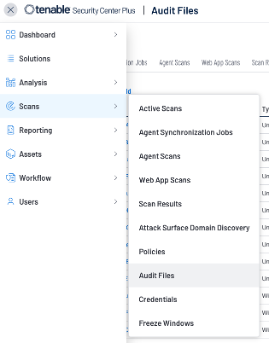
* Select **+ Add** and choose the **Advanced** option under **Other**.  
* Fill in the **Name**, **Description**, and select the “.audit” file.  
* Click **Submit**.  
* Repeat this with all Audit files.  
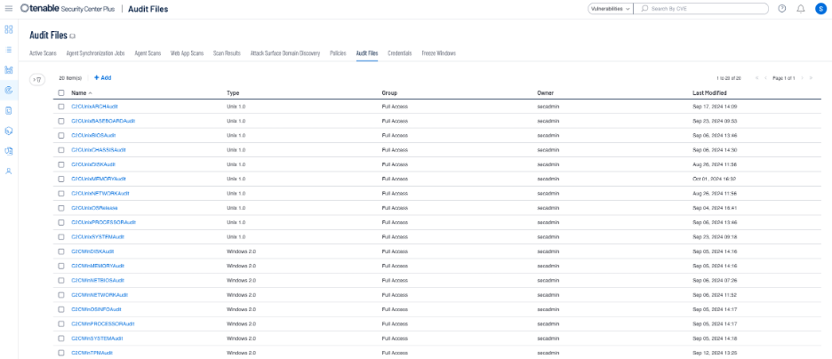


## Create a Policy Template for Auditing

* Navigate to **Scans > Policies** and click **+Add**.  
    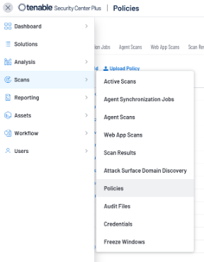
* Select the **Policy Compliance Auditing** option.  
    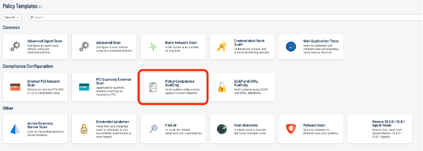
* Input the **Name** and **Description** on the **Setup** tab.  
* Click on the **Compliance** tab and **Add Audit File** for all the Audit files for Windows or Unix. Repeat for other OS.  
    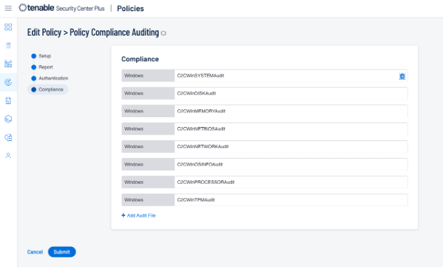

## Create Active Scan

* Navigate to **Scans > Active Scans** and click **+Add**.  
    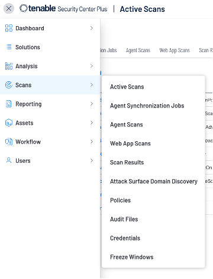
* Give the Scan a **Name**, **Description**, and **Schedule**.  
* Under **Policy**, select the Scan Policy built in the previous step.  
    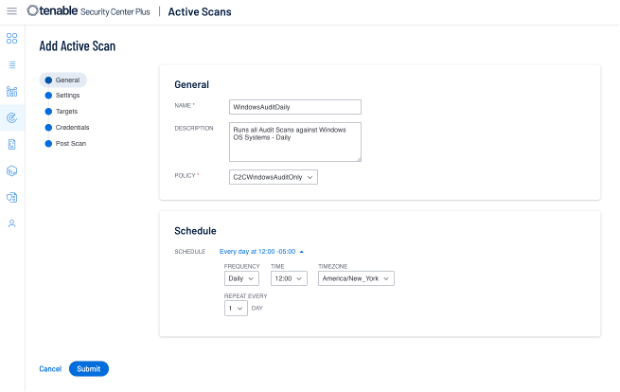
* Under the **Targets** tab, select the target types. You can use the Asset classification, IP Address/DNS, or both.  
    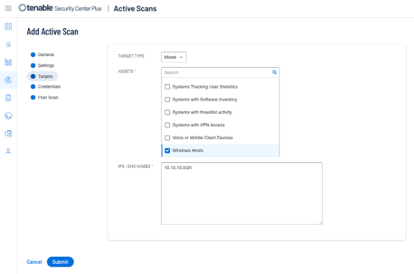
* Finally, under the **Credentials** tab, add the credentials that will enable remote login and command execution on the device.  
    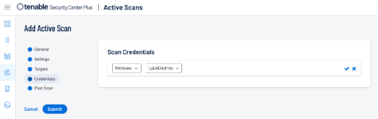

*   **For Windows systems**: The account must be able to run privileged PowerShell commands via Local user or Domain privileges.
*   **Unix/Linux systems**: Accounts must be able to run the `dmidecode` and `lshw` sudo commands without password input using the following sudoers file modification examples below:

```
    # Ubuntu:
    #   USERNAME ALL=NOPASSWD:{COMMAND},/usr/sbin/dmidecode, /usr/sbin/lshw
    # RHEL
    #   USERNAME ALL=(ALL) NOPASSWD: /usr/sbin/dmidecode, /usr/bin/lshw
```
## Audit File Plugin IDs

Tenable assigns a Plugin-ID to each Audit file at the time of import. Predicting the ID is not possible, so each environment will likely have differing IDs for the audit files based on the import order and description. Once imported, the Plugin ID does not change unless the description of the audit file changes.

To identify the plugin ID, you can trigger the Active Scan to run on the environment and then look at the Scan Results when complete or search the plugin DB for any Plugin with an ID >= 1000000.

### To search the Plugin DB:
Navigate to the top right corner where the User Icon is displayed and click on the icon. Select **Plugins** and the **Filter** icon on the top left where you can specify **Plugin ID >= 1000000**.  
    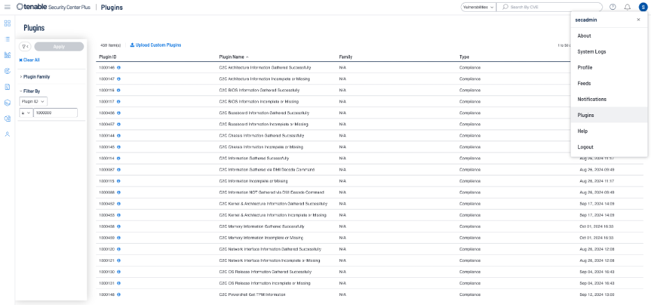

### To see the plugin IDs from the Active Scan:
Navigate to **Scans > Scan Results** and find the latest run of the Active Scan you built. Click on the Name of the scan to open. On this page, you will see the Plugin IDs and the associated Audit File Description from the imported files.  
    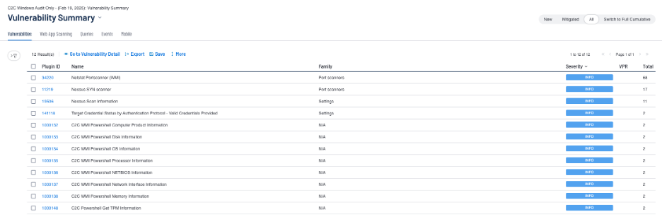

Take note of what ID is associated with what information, as this will need to be updated in Splunk Search Macros for the data to be extracted correctly.

## Updating Splunk Search Macros

Once the Plugin IDs have been identified, you will need to update the Search Macros on Splunk to properly extract the data from the Audit file command output.

* In Splunk, navigate to **Settings > Knowledge > Advanced Search > Search Macros**.
* To filter the view of the macros, select the **App** dropdown and select the **Cisco Enterprise Networking for Splunk Platform** app to see the macros associated with the app.
* Additionally, you can use the filter option with the word **plugin**
* Using the mappings that you determined earlier, you can update the macro definitions to match the Plugin IDs from your environment.
    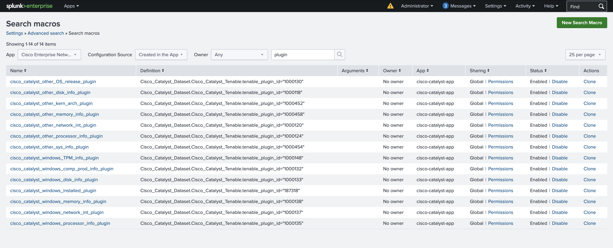